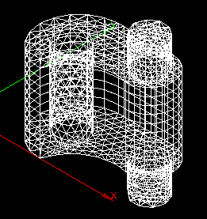
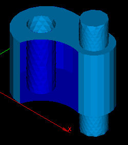
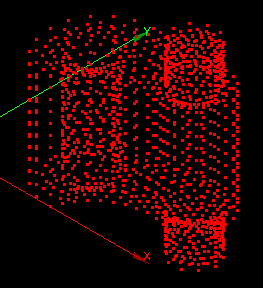
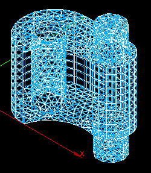

.. _display_mode_page:

************
Display Mode
************

By default your objects are represented as defined in :ref:`mesh_tab_preferences`.
However, right-clicking on the mesh in the **Object Browser**, and selecting **Display Mode**, you can display your mesh as:

.. centered::
	Wireframe

.. centered::
	Shading

.. centered::
	Nodes

**Wireframe** can combine with **Nodes** and **Shading**.

**Shading** and **Wireframe** modes can combine with **Shrink**, however **Nodes** can't.

.. centered::
	Shrink

