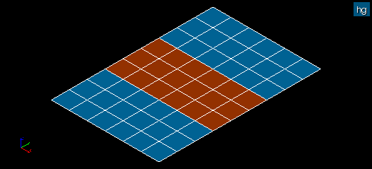

.. _double_elements_page: 

********************************************
Double edge, Double faces and Double volumes
********************************************

These mesh quality controls highlight the mesh elements basing on the same set of nodes.

In this picture some faces are coincident after copying all elements with translation with subsequent Merge of nodes.

*A sample TUI Script of a* :ref:`filter_double_elements`:.

