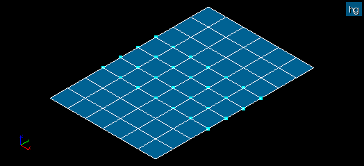

.. _double_nodes_control_page:

************
Double nodes
************

This mesh quality control highlights the nodes which are coincident with other nodes (within a given tolerance). Distance at which two nodes are considered coincident is defined by :ref:`dbl_nodes_tol_pref` preference.

In this picture some nodes are coincident after copying all elements with translation.

**See also**: A sample TUI Script of a :ref:`tui_double_nodes_control` filter.

