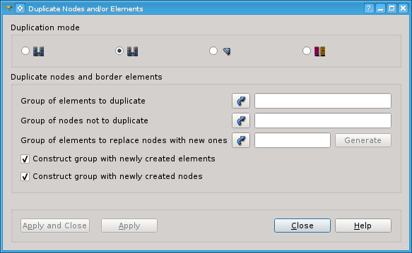
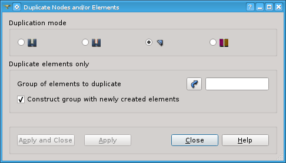
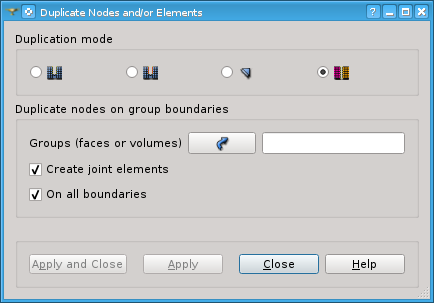

.. _double_nodes_page:

*******************************
Duplicate Nodes or/and Elements
*******************************

This operation allows duplicating mesh nodes or/and elements, which can be useful to emulate a crack in the model.

Duplication consists in creation of mesh elements "equal" to existing ones.

*To duplicate nodes or/and elements:*

#. From the **Modification** menu choose **Transformation** -> **Duplicate Nodes or/and Elements** item or click *"Duplicate Nodes or/and Elements"* button |img| in the toolbar.
#. Check in the dialog box one of four radio buttons corresponding to the type of duplication operation you would like to perform.
#. Fill the other fields available in the dialog box (depending on the chosen operation mode).
#. Click the **Apply** or **Apply and Close** button to perform the operation of duplication. 

"Duplicate Nodes or/and Elements" dialog has four working modes:

	* :ref:`mode_without_elem_anchor`
	* :ref:`mode_with_elem_anchor`
	* :ref:`mode_elem_only_anchor`
	* :ref:`mode_group_boundary_anchor`

.. _mode_without_elem_anchor:

Duplicate nodes only
####################
   
	.. image:: ../images/duplicate01.png 
		:align: center

Parameters to be defined in this mode:

	* **Group of nodes to duplicate** (*mandatory*): these nodes will be duplicated.
	* **Group of elements to replace nodes with new ones** (*optional*): the new nodes will replace the duplicated nodes within these elements. **Generate** button tries to automatically find such elements and creates a group of them. This button becomes active as soon as **Group of nodes to duplicate** is selected.
	* **Construct group with newly created nodes** option (*checked by default*): if checked - the group with newly created nodes will be built. 

A schema below illustrates how the crack is emulated using the node duplication.
    
.. image:: ../images/crack_emulation_double_nodes.png 
	:align: center

.. centered::
	Crack emulation

This schema shows a virtual crack in a 2D mesh created using this duplication mode:
	* Black balls are **duplicated nodes**.
	* Red balls are **new nodes**.
	* **Elements to replace nodes with new ones** are marked with green.
	
.. note::
	Note that in the reality **duplicated nodes** coincide with **new nodes**.

.. _mode_with_elem_anchor:

Duplicate nodes and border elements
###################################

Parameters to be defined in this mode:

	* **Group of elements to duplicate** (*mandatory*): these elements will be duplicated. 
	* **Group of nodes not to duplicate** (*optional*): group of nodes at crack bottom which will not be duplicated.
	* **Group of elements to replace nodes with new ones** (*mandatory*): the new nodes will replace the nodes to duplicate within these elements. **Generate** button tries to automatically find such elements and creates a group of them. This button becomes active as soon as **Group of elements to duplicate** is selected.
	* **Construct group with newly created elements** option (*checked by default*): if checked - the group of newly created elements will be built.
	* **Construct group with newly created nodes** option (*checked by default*): if checked - the group of newly created nodes will be built.

A schema below explains the crack emulation using the node duplication with border elements.

	.. image:: ../images/crack_emulation_double_nodes_with_elems.png 
		:align: center

	.. centered::  
		Crack emulation

This schema shows a virtual crack in a 2D mesh created using this duplication mode. In this schema:

* Black segments are **duplicated elements** (edges in 2D case).
* Black balls (except for the lowest one) are duplicated nodes of **duplicated elements**.
* The lowest black ball is the **non-duplicated node**.
* Red balls are **newly created nodes**.
* Red segments are **created elements** (edges).
* **Elements to replace nodes with new ones** are marked with green.

Note that in the reality **nodes to duplicate** coincide with **new nodes**.

In a 3D case, where **elements to duplicate** are faces, the edges
located at the "crack" (if any) are cloned automatically.

.. _mode_elem_only_anchor:

Duplicate elements only
#######################

This mode duplicates the given elements, i.e. creates new elements with the same nodes as the given elements.

Parameters to be defined in this mode:

	* **Group of elements to duplicate** (*mandatory*): these elements will be duplicated.
	* **Construct group with newly created elements** option (*checked by default*): if checked - the group of newly created elements will be built. The name of the created group starts from "DoubleElements".

.. _mode_group_boundary_anchor:

Duplicate nodes on group boundaries
###################################

This mode duplicates nodes located on boundaries between given groups of volumes.

Parameters to be defined in this mode:

	* **Groups (faces or volumes)** (*mandatory*): list of mesh groups. These groups should be disjoint, i.e. should not have shared elements.
	* If **Create joint elements** option is activated, flat elements are created on the duplicated nodes: a triangular facet shared by two volumes of two groups generates a flat prism, a quadrangular facet generates a flat hexahedron. Correspondingly 2D joint elements (null area faces) are generated where edges are shared by two faces. The created flat volumes (or faces) are stored in groups. These groups are named according to the position of the group in the list of groups: group "j_n_p" is a group of flat elements that are built between the group \#n and the group \#p in the group list. All flat elements are gathered into the group named "joints3D" (correspondingly "joints2D"). The flat elements of multiple junctions between the simple junction are stored in a group named "jointsMultiples".
	* If **On all boundaries** option is activated, the volumes (or faces), which are not included into **Groups** input, are considered as another group and thus the nodes on the boundary between **Groups** and the remaining mesh are also duplicated.

**See Also** a sample TUI Script of a :ref:`tui_duplicate_nodes` operation.

