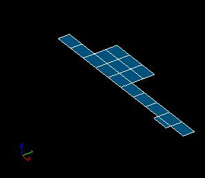

.. _extrusion_page:

*********
Extrusion
*********

Extrusion is used to build mesh elements of plus one dimension than the input ones. Boundary elements around generated mesh of plus one dimension are additionally created. All created elements can be automatically grouped. Extrusion can be used to create a :ref:`structured mesh from scratch <extrusion_struct>`.

.. centered::
	If you extrude several quadrangles, you get exactly the same mesh as if you meshed a geometrical box (except for that the initial quadrangles can be incorrectly oriented): quadrangles and segments are created on the boundary of the generated mesh

Any node, segment or 2D element can be extruded. Each type of elements is extruded into a corresponding type of result elements:

+----------------------+--------------------+
| **Extruded element** | **Result element** |
+======================+====================+
|Node                  | Segment            |
+----------------------+--------------------+
|Segment               | Quadrilateral      |
+----------------------+--------------------+
|Triangle              | Pentahedron        |
+----------------------+--------------------+
|Quadrilateral         | Hexahedron         |
+----------------------+--------------------+
|Polygon               | Polyhedron         |
+----------------------+--------------------+
|Hexagonal polygon     | Hexagonal prism    |
+----------------------+--------------------+

When 2D elements are extruded, in addition to 3D elements segments are created on the ribs of the resulting 3D mesh. Free edges of input 2D elements generate logically horizontal rib segments. Logically vertical rib segments are generated from the nodes belonging to a sole input 2D element (the figure below illustrates this rule).

.. centered::
	Two triangles extruded: no vertical rib segments generated from nodes #2 and #3 as they are shared by both triangles

*To use extrusion:*

.. |sel_img| image:: ../images/image120.png

#. From the **Modification** menu choose the **Extrusion** item or click *"Extrusion"* button |img| in the toolbar. 

   The following dialog will appear:

	.. image:: ../images/extrusionalongaline1.png
		:align: center

#. In this dialog:

	* Use *Selection* button |sel_img| to specify what you are going to select at a given moment, **Nodes**, **Edges** or **Faces**.
  
	* Specify **Nodes**, **Edges** and **Faces**, which will be extruded, by one of following means:
		* **Select the whole mesh, sub-mesh or group** activating the corresponding check-box.
		* Choose mesh elements with the mouse in the 3D Viewer. It is possible to select a whole area with a mouse frame. 
		* Input the element IDs directly in **Node IDs**, **Edge IDs** and **Face IDs** fields. The selected elements will be highlighted in the viewer, if the mesh is shown there. 
		* Apply Filters. **Set filter** button allows to apply a filter to the selection of elements. See more about filters in the :ref:`filtering_elements` page. 

	* If the **Extrusion to Distance** radio button is selected 
		* specify the translation vector by which the elements will be extruded.

	* If the **Extrusion Along Vector** radio button is selected

		.. image:: ../images/extrusionalongaline2.png  
			:align: center
    
		* specify the components of the **Vector** along which the elements will be extruded, either directly or by selecting the mesh face (the normal to the face will define the vector),
		* specify the **Distance** of extrusion along the vector (it can be negative).
    
  

	* If the **Extrusion By Normal** radio button is selected, every node of the selected faces is extruded along the *average* of the *normal* vectors to the faces sharing the node. (Nodes and edges cannot be extruded in this mode.)

		.. image:: ../images/extrusionalongaline3.png 
			:align: center
    
		* Specify the **Distance** of extrusion (it can be negative),
		* Use **Along average normal** check-box to specify along which vector the distance is measured.
		* If it is *activated* the distance is measured along the average normal mentioned above. 
		* If it is *deactivated* every node is extruded along the average normal till its intersection with a virtual plane obtained by translation of the face sharing the node along its own normal by the **Distance**.
        
        	The picture below shows a cross-section of a 2D mesh extruded with **Along average normal** activated (to the left) and deactivated (to the right). 

	        .. image:: ../images/extrusionbynormal_alongavgnorm.png
			:align: center

		.. centered::
			'Along average normal' activated (to the left) and deactivated (to the right)

		* **Use only input elements** check-box specifies what elements will be used to compute the average normal.

                  * If it is *activated* only selected faces, among faces sharing the node, are used to compute the average normal at the node. 
                  * Else all faces sharing the node are used.

                  The picture below shows a cross-section of a 2D mesh the upper plane of which is extruded with **Use only input elements** activated (to the left) and deactivated (to the right). 

	.. image:: ../images/extrusionbynormal_useonly.png
		:align: center

	.. centered::
		'Use only input elements' activated (to the left) and deactivated (to the right)
  
  
        .. |add| image:: ../images/add.png
        .. |rm| image:: ../images/remove.png

	* Specify the **Number of steps**.
	* Optionally specify **Scale Factors**. Each scale factor in the list is applied to nodes of a corresponding extrusion step unless **Linear Variation of Scale Factors** is checked, is which case the scale factors are spread over all extrusion steps.
		* **Scaling Center** can be defined either using spin boxes or by picking a node in the Viewer or by picking a geometrical vertex in the Object Browser.
		* **Add** button |add| adds a scale factor to the list.   
		* **Remove** button |rm| removes selected scale factors from the list.

	* If you activate **Generate Groups** check-box, the **result elements** created from **selected elements** contained in groups will be included into new groups named by pattern "<old group name>_extruded" and "<old group name>_top". For example if a selected quadrangle is included in *g_Faces* group (see figures below) then result hexahedra will be included in *g_Faces_extruded* group and a quadrangle created at the "top" of extruded mesh will be included in *g_Faces_top group*.  

		.. image:: ../images/extrusion_groups.png
			:align: center

		.. image:: ../images/extrusion_groups_res.png
			:align: center

          This check-box is active only if there are some groups in the mesh.
  

#. Click **Apply** or **Apply and Close**  button to confirm the operation.

.. _extrusion_struct:

Example: creation of a structured mesh from scratch
###################################################

.. centered::
	A node is extruded into a line of segments

.. centered::
	The line of segments is extruded into a quadrangle mesh

.. centered::
	The quadrangle mesh is revolved into a hexahedral mesh

**See Also** a sample TUI Script of an :ref:`tui_extrusion` operation. 

