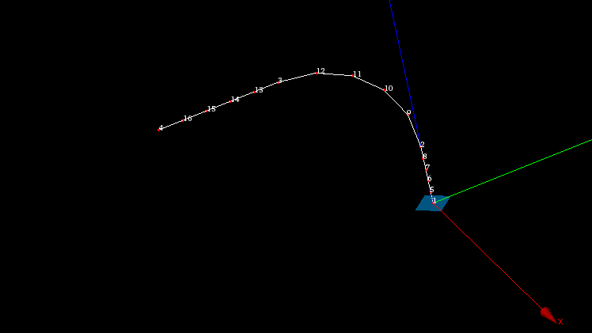

.. _extrusion_along_path_page:

********************
Extrusion along Path
********************

In principle, **Extrusion along Path** works in the same way as :ref:`extrusion_page`, the main difference is that we define not a vector, but a path of extrusion which must be an 1D mesh or 1D sub-mesh.
To get an idea of how this algorithm works, examine several examples, starting from the most simple case of extrusion along a straight edge.
In the examples the sample mesh will be extruded along different paths and with different parameters.
This 2D mesh has two quadrangle faces and seven edges. Look at the picture, where white digits are the node numbers and green are the element numbers:

Extrusion along a straight edge
*******************************
(not using base point or angles)

.. centered::
	The image shows a 1D path mesh, built on a linear edge, and the initial 2D mesh.

.. centered::
	The image shows the result of extrusion of two edges (#1 and #2) of the initial mesh along the path. 

.. note:: Node #1 of path mesh has been selected as Start node.

Extrusion along a curvilinear edge
##################################
(with and without angles)

.. centered::
	The image shows a 1D path mesh, built on curvilinear edge, and the initial  2D mesh.

.. centered::
	The central image shows the result of extrusion of one edge (#2) of the initial mesh along the path. 

.. note:: Node #1 of path mesh has been selected as **Start node**.

.. centered::
	The same, but using angles {45, 45, 45, 0, -45, -45, -45}

Extrusion of a 2D face along a mesh built on a wire
###################################################

In this example the path mesh has been built on a wire containing 3 edges. Node 1 is a start node. Linear angle variation by 180 degrees has also been applied.

.. centered::
	**Meshed wire**

.. centered::
	**The resulting extrusion**

Extrusion of 2d elements along a closed path
############################################

.. centered::
	The image shows a path mesh built on a closed edge (circle).

.. centered::
	The central image shows the result of extrusion of both faces of the initial mesh. 

.. note:: Note, that no sewing has been done, so, there are six coincident nodes and two coincident faces in the resulting mesh.

.. centered::
	The same, but using angles {45, -45, 45, -45, 45, -45, 45, -45}

**To use Extrusion along Path:**

#. From the **Modification** menu choose the **Extrusion along a path** item or click **"Extrusion along a path"** button in the toolbar.

	.. image:: ../images/image101.png
		:align: center

	.. centered::
		**"Extrusion along a path" button**

	The following dialog will appear:

	.. image:: ../images/extrusion_along_path_dlg.png

#. In this dialog:

	* Use *Selection* button to specify what you are going to select at a given moment, **Nodes**, **Edges** or **Faces**.

	.. image:: ../images/image120.png
		:align: center

	.. centered::
		**"Selection" button**
    
	* Specify **Nodes**, **Edges** and **Faces**, which will be extruded, by one of following means:
      
		* **Select the whole mesh, sub-mesh or group** activating this check-box.
		* Choose mesh elements with the mouse in the 3D Viewer. It is possible to select a whole area with a mouse frame.
		* Input the element IDs directly in **Node IDs**, **Edge IDs** and **Face IDs** fields. The selected elements will be highlighted in the viewer, if the mesh is shown there.
		* Apply Filters. **Set filter** button allows to apply a filter to the selection of elements. See more about filters in the :ref:`filtering_elements` page.
    
	* Define the **Path** along which the elements will be extruded.Path definition consists of several elements:
      
		* **Mesh or sub-mesh** - 1D mesh or sub-mesh, along which proceeds the extrusion.
		* **Start node** - the start node of the Path. It is used to define the direction of extrusion. 
      
    
	* If you activate **Generate Groups** check-box, the **result elements** created from **selected elements** contained in groups will be included into new groups named by pattern "<old group name>_extruded" and "<old group name>_top". For example if a  selected quadrangle is included in *g_Faces* group (see figures below) then result hexahedra will be included in *g_Faces_extruded* group and a quadrangle created at the "top" of extruded mesh will be included in *g_Faces_top group*.  

	.. image:: ../images/extrusion_groups.png
		:align: center

	.. image:: ../images/extrusion_groups_res.png
		:align: center

	This check-box is active only if there are some groups in the mesh.
  

#. There are two optional parameters, which can be very useful:

#. If the path of extrusion is curvilinear, at each iteration the extruded elements are rotated to keep its initial angularity to the curve. By default, the **Base Point** around which the elements are rotated is the mass center of the elements (note that it can differ from the gravity center computed by *Geometry* module for the  underlying shape), however, you can specify any point as the **Base Point** and the elements will be rotated with respect to this point. Note that only the displacement of the **Base Point** exactly equals to the path, and all other extruded elements simply keep their position relatively to the **Base Point** at each iteration.

#. The elements can also be rotated around the path to get the resulting mesh in a helical fashion. You can set the values of angles at the right, add them to the list of angles at the left by pressing the **"Add"** button and remove them from the list by pressing the **"Remove"** button.

	.. image:: ../images/add.png
		:align: center

	.. centered::
		**"Add" button**

	.. image:: ../images/remove.png
		:align: center

	.. centered::
		**"Remove" button**

	**Linear variation of the angles** option allows defining the angle of gradual rotation for the whole path. At each step the elements will be rotated by *( angle / nb. of steps )*.

#. Click **Apply** or **Apply and Close**  button to confirm the operation. Mesh edges will be extruded into faces, faces into volumes. The external surface of the resulting 3d mesh (if faces have been extruded) is covered with faces, and corners with edges. If the path is closed, the resulting mesh can contain duplicated nodes and faces, because no sewing is done.

**See Also** a sample TUI Script of an :ref:`tui_extrusion_along_path` operation.  

