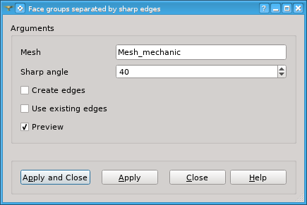
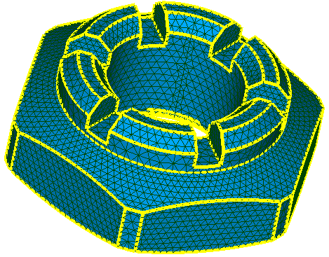

************************************
Face Groups Separated By Sharp Edges
************************************

**Face groups separated by sharp edges** operation distributes all faces of the mesh among groups using sharp edges and optionally existing 1D elements as group boundaries. Edges where more than two faces meet are always considered as a group boundary. The operation is available in **Mesh** menu.

The operation dialog looks as follows:

In this dialog box specify

	* **Mesh** including the faces to distribute among groups.
        * **Sharp angle** in degrees, by which edges used as group boundaries are detected. An edge is considered as a group boundary if an angle between normals of adjacent faces is more than this angle.
	* Activate **Create edges** option if you wish that 1D elements to be created (if not yet exist) on the edges that served as group boundaries.
	* Activate **Use existing edges** option if you wish that existing 1D elements to be used as group boundaries.
	* Activate **Preview** to see the edges that will be used as group boundaries highlighted in the Viewer.

.. centered:: 
	**Preview of boundary edges detected at Sharp Angle = 10 degrees**

**See Also** a sample TUI Script of a :ref:`tui_groups_by_sharp_edges` operation.

