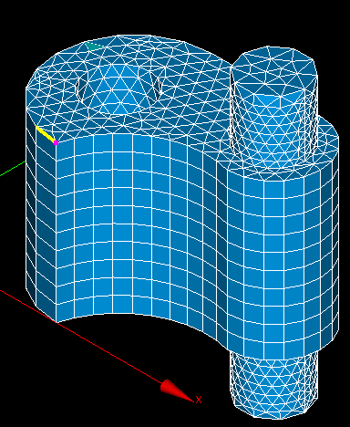

.. _find_element_by_point_page:

*********************
Find Element by Point
*********************

This functionality allows you to find all mesh elements to which belongs a certain point.

**To find the elements:**
#. Select a mesh or a group
#. Select from the Mesh menu or from the context menu the Find Element by Point item.

	.. image:: ../images/findelement3.png
		:align: center

	.. centered:: 
		**"Find Element by Point" button**

	The following dialog box will appear:

	.. image:: ../images/findelement2.png
		:align: center

#. In this dialog box you should select:
	* the coordinates of the point;
	* the type of elements to be found; it is also possible to find elements of all types related to the reference point. Choose type "All" to find elements of any type except for nodes and 0D elements.
#. Click the **Find** button.

.. centered:: 
	The reference point and the related elements.

**See Also** a sample TUI Script of a :ref:`tui_find_element_by_point` operation.

