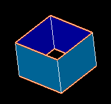

.. _free_borders_page:

************
Free borders
************

This mesh quality control highlights 1D elements (segments) belonging to one element (face or volume) only.

In this picture the free borders are displayed in red. (Faces are explicitly shown via **Display Entity** menu as all elements but segments are hidden upon this control activation).

**See Also** a sample TUI Script of a :ref:`tui_free_borders` filter.

