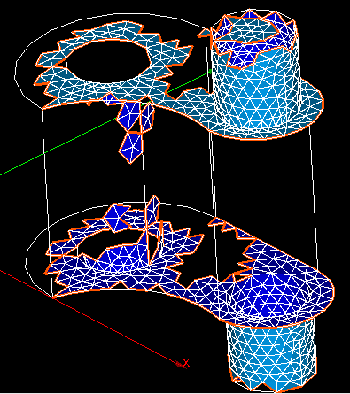

.. _free_edges_page:

**********
Free edges
**********

This mesh quality control highlights borders of faces (links between nodes, not mesh segments) belonging to one face only.

.. centered::
	Some elements of mesh have been deleted and the "holes" are outlined in red.

**See Also** a sample TUI Script of a :ref:`tui_free_edges` filter.
