.. _homard_create_boundary:

The boundary
############
.. index:: single: boundary
.. index:: single: frontière
.. index:: single: CAO

The object boundary contains all the geometrical definitions allowing to describe a curved boundary to be followed.

There are two modes of description of a boundary:

  - CAO: the boundary comes from the geometry of the domain
  - Non CAO: if the CAO is not available, the boundary can be approximated by its descriptions:

    * Discrete: to describe the set of 1D curves that defines the boundary
    * Analytics: to describe every surface that defines the boundary

This choice is:

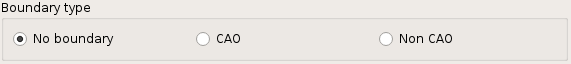

.. _homard_create_boundary_CAO:

CAO boundary
************

The follow-up of a CAO boundary will be made by selecting a boundary chosen in the list of the existing CAO boundaries.

In the starting up, the list is empty. It is necessary to create a first CAO boundary by activation of the button "*New*":

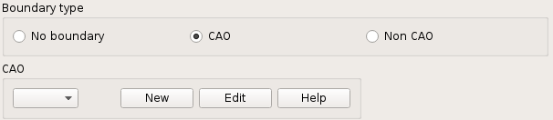

The window invites in the choice of a file that contains the CAO with XAO format. This CAO is the one that is the basis for the initial mesh. A name of boundary is automatically proposed: Boun_1, Boun_2, etc. This name can be modified. It must not already have been used for another boundary, whatever its type.

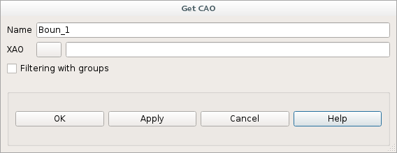

.. note::
  The coherence between this CAO and the initial mesh is not checked.

Filtering by the groups
***********************
.. index:: single: group

We can restrict the application of the boundary to groups. So elements not belonging to these groups will not be affected. We check the associated button **Filtering with groups**. The list of the present groups of elements in the mesh is shown. It is enough to check those wanted to restrict the boundary.

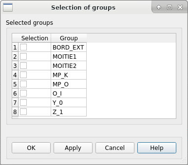

.. _homard_create_boundary_Di:

Discrete boundary
*****************

The follow-up of a discrete boundary will be made by selecting a boundary chosen in the list of the existing discrete boundaries.

In the starting up, the list is empty. It is necessary to create a first discrete boundary by activation of the button "*New*":

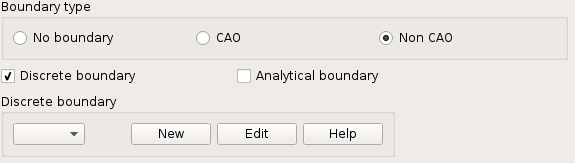

The window invites in the choice of a file of mesh. This mesh is the one of all the lines constituting the boundary. A name of boundary is automatically proposed: Boun_1, Boun_2, etc. This name can be modified. It must not already have been used for another boundary, whatever its type.

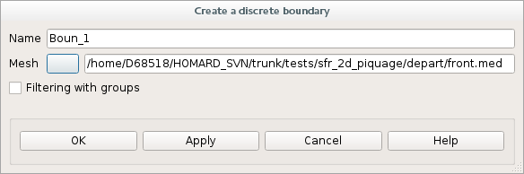

.. note::
  The file has to contain only a single mesh.

If discrete boundaries were already defined for another case, we can select one of them. We can also create a new discrete boundary by activation of the button "*New*", as explained previously.

.. image:: ../images/create_boundary_di_3.png
   :align: center

.. _homard_create_boundary_An:

Analytical boundary
*******************
In the starting up, SALOME shows a table with one only one column. This column contains the list of all the groups of the initial mesh defining the case.

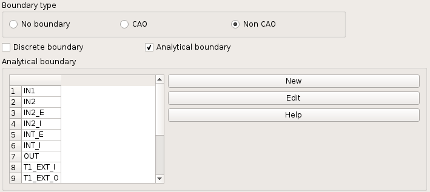

It is necessary to create a first analytical boundary by activation of the button "*New*". We shall have the choice between cylinder, sphere, cone or torus. When the boundary will be validated, its name will appear in header of the second column.

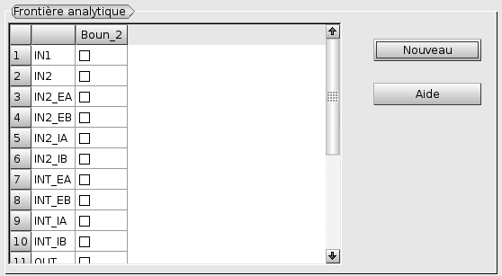

It is now necessary to establish the link enter the mesh defining the case and this boundary described analytically. It is made by checking the groups of the faces which have to be on the boundary.

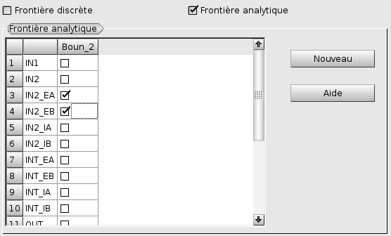

This operation is repeated as often as we wish to place faces of meshs on a curved surface:

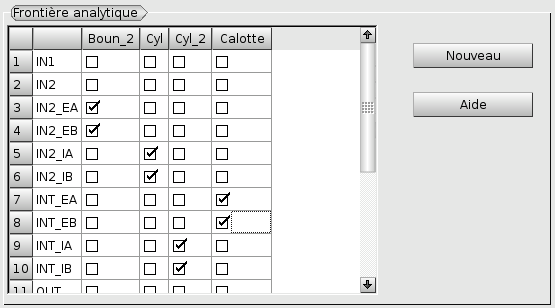

.. note::

  A group can be checked very well never: it means that the elements which it defines belong to none of the described boundaries.

  A group can be checked only once. Indeed, surface elements cannot belong to more than one surface.

  Several groups can be checked for the same boundary. It occurs if the initial mesh of the zone was subdivided into several groups: all the surface elements belong to this surface but were distributed in several groups.

  Conversely, a boundary can be very well retained by no group. It occurs if it was defined for a previous case and if it is groundless for the case in the course of definition.

There are four types of analytical boundary:

  - Cylindre
  - Sphere
  - Cone, described by an axis and an angle or by two radius
  - Torus

.. note::
  The numerical values proposed by default take into account the geometry of the mesh.

Cylindre
========
.. index:: single: cylindre

The cylinder is defined by a point of the axis, its axis and its radius. The axis is defined by a vector. The standard of this vector is not inevitably equal to 1; also, its orientation has no importance. A name of boundary is automatically proposed: Boun_1, Boun_2, etc. This name can be modified. It must not already have been used for another boundary, whatever its type.

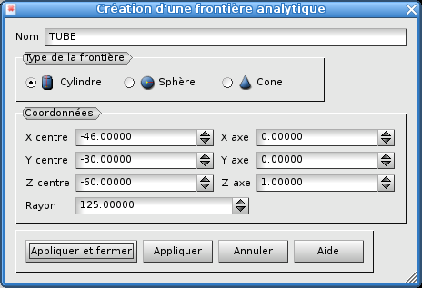

Sphere
======
.. index:: single: sphere

The sphere is defined by its center and its radius. A name of boundary is automatically proposed: Boun_1, Boun_2, etc. This name can be modified. It must not already have been used for another boundary, whatever its type.

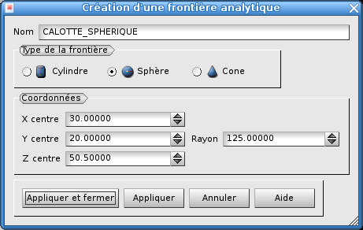

Cone
====
.. index:: single: cone

A cone is defined by two different manners: the center, the axis and the angle of opening in degree or by two points centered on the axis and the associated radius. A name of boundary is automatically proposed: Boun_1, Boun_2, etc. This name can be modified. It must not already have been used for another boundary, whatever its type.

Creation by an origin, an axis and an angle of opening:

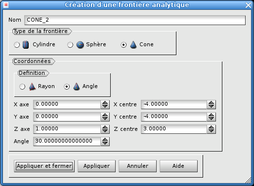

Creation by two points centered on the axis and the associated radius:

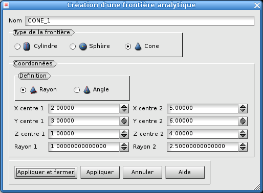

.. index:: single: object browser

Torus
=====
.. index:: single: torus

The torus is defined by its centre, its axis, the revolution radius and the primary radius. The axis is defined by a vector. The standard of this vector is not inevitably equal to 1; also, its orientation has no importance. A name of boundary is automatically proposed: Boun_1, Boun_2, etc. This name can be modified. It must not already have been used for another boundary, whatever its type.

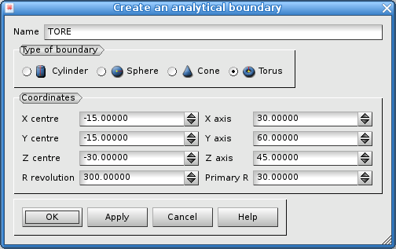
