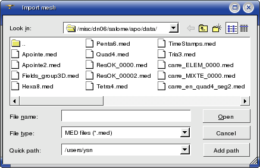
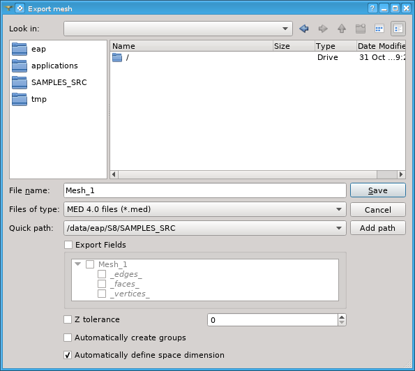
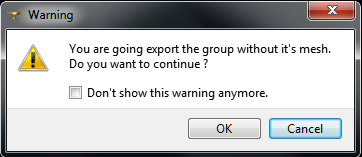

.. _importing_exporting_meshes_page:

******************************
Importing and exporting meshes
******************************

In MESH there is a functionality allowing import/export of meshes from/to **MED**, **UNV** (I-DEAS 10), **DAT** (simple ascii format), **STL**, **GMF** (internal format of DISTENE products, namely MG-CADSurf, MG-Tetra and MG-Hexa algorithms) and **CGNS** format files. You can also export a group as a whole mesh.

**To import a mesh:**

#. From the **File** menu choose the **Import** item, from its sub-menu select the corresponding format (MED, UNV, STL, GMF and CGNS) of the file containing your mesh.
#. In the standard **Search File** dialog box find the file for import. It is possible to select multiple files to be imported all at once.  
#. Click the **OK** button.

**To export a mesh or a group:**

#. Select the object you wish to export.
#. From the **File** menu choose the **Export** item, from its sub-menu select the format (MED, UNV, DAT, STL, GMF and CGNS) of the file which will contain your exported mesh.
#. In the standard **Search File** select a location for the exported file and enter its name.
#. Click the **OK** button.

If you try to export a group, the warning will be shown:

* **Don't show this warning anymore** check-box allows to switch off the warning. You can re-activate the warning in :ref:`group_export_warning_pref`.

There are additional parameters available at export to MED and SAUV format files.

.. _export_auto_groups:

Auto Groups
===========

	* **Automatically create groups** check-box specifies whether to create groups of all mesh entities of available dimensions or not. The created groups have names like "Group_On_All_Nodes", "Group_On_All_Faces", etc. A default state of this check-box can be set in :ref:`export_auto_groups_pref`. 
	* **Automatically define space dimension** check-box specifies whether to define space dimension for export by mesh configuration or not. Usually the mesh is exported as a mesh in 3D space, just as it is in Mesh module. The mesh can be exported as a mesh of a lower dimension in the following cases, provided that this check-box is checked:
		* **1D**: if all mesh nodes lie on OX coordinate axis. 
		* **2D**: if all mesh nodes lie in XOY coordinate plane. 

**See Also** a sample TUI Script of an :ref:`tui_export_mesh` operation.

