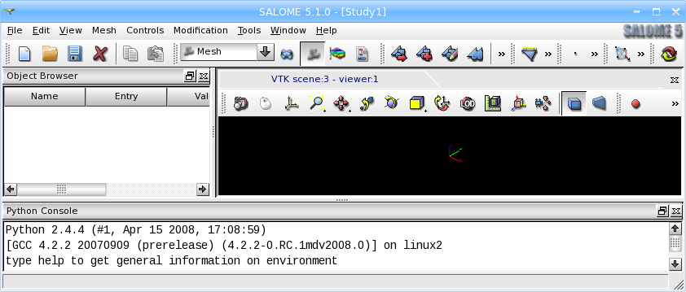

.. SMESH documentation master file, created by
   sphinx-quickstart on Tue Nov 21 15:18:10 2017.
   You can adapt this file completely to your liking, but it should at least
   contain the root `toctree` directive.

***************************
Introduction to Mesh module
***************************

**Mesh** module of SALOME is destined for:

* :ref:`creating meshes <about_meshes_page>` in different ways:

  * by meshing geometrical models previously created or imported by the Geometry component; 
  * bottom-up, using :ref:`mesh edition <modifying_meshes_page>`, especially :ref:`extrusion <extrusion_page>` and :ref:`revolution <revolution_page>`;
  * by generation of the 3D mesh from the 2D mesh not based on the geometry (:ref:`imported <importing_exporting_meshes_page>` for example); 
 
* :ref:`importing and exporting meshes <importing_exporting_meshes_page>` in various formats;
* :ref:`modifying meshes <modifying_meshes_page>` with a vast array of dedicated operations; 
* :ref:`creating groups <grouping_elements_page>` of mesh elements;
* filtering mesh entities (nodes or elements) using :ref:`Filters <filters_page>` functionality for :ref:`creating groups <grouping_elements_page>` and applying :ref:`mesh modifications <modifying_meshes_page>`;
* :ref:`viewing meshes <viewing_meshes_overview_page>` in the VTK viewer and :ref:`getting info <mesh_infos_page>` on mesh and its sub-objects;
* applying to meshes :ref:`Quality Controls <quality_page>`, allowing to highlight important elements;
* taking various :ref:`measurements <measurements_page>` of the mesh objects.

There is a set of :ref:`tools <tools_page>` plugged-in the module to extend the basic functionality listed above.

Almost all mesh module functionalities are accessible via :ref:`smeshpy_interface_page`.

It is possible to use the variables predefined in :ref:`Salome notebook <using_notebook_mesh_page>` to set parameters of operations.

Mesh module preferences are described in the :ref:`mesh_preferences_page` section of SALOME Mesh Help.

.. image:: ../images/image7.jpg
	:align: center 

.. centered::
	Example of MESH module usage for engineering tasks

**Table of Contents**

.. toctree::
   :titlesonly:
   :maxdepth: 3

   about_meshes
   modifying_meshes
   grouping_elements
   about_filters
   about_quality_controls
   measurements
   viewing_meshes_overview
   smeshpy_interface
   tools	
   mesh_preferences
   using_notebook_smesh_page
