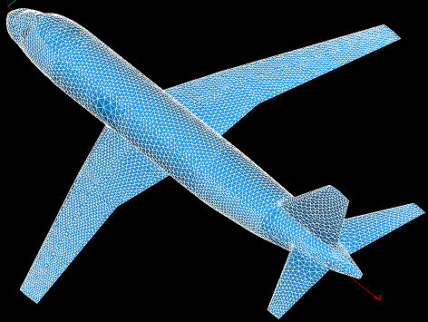

***************************
Introduction to Mesh module
***************************

.. image:: ../images/a-viewgeneral.png
	:align: center

**Mesh** module of SALOME is destined for:

* :ref:`creating meshes <about_meshes_page>` in different ways:
	* by meshing geometrical models previously created or imported by the Geometry component; 
	* bottom-up, using :ref:`modifying_meshes_page`, especially :ref:`extrusion_page` and :ref:`revolution_page`;
	* by generation of the 3D mesh from the 2D mesh not based on the geometry (:ref:`importing_exporting_meshes_page` for example); 
 
* :ref:`importing_exporting_meshes_page` in various formats;
* :ref:`modifying_meshes_page` with a vast array of dedicated operations; 
* :ref:`grouping_elements_page` of mesh elements;
* filtering mesh entities (nodes or elements) using :ref:`filters_page` functionality for :ref:`grouping_elements_page` and applying :ref:`modifying_meshes_page`;
* :ref:`viewing_meshes_overview_page` in the VTK viewer and :ref:`mesh_infos_page` on mesh and its sub-objects;
* applying to meshes :ref:`quality_page`, allowing to highlight important elements;
* taking various :ref:`measurements_page` of the mesh objects.

It is possible to use the variables predefined in :ref:`using_notebook_mesh_page` to set parameters of operations.
Mesh module preferences are described in the :ref:`mesh_preferences_page` section of SALOME Mesh Help.
Almost all mesh module functionalities are accessible via :ref:`smeshpy_interface_page`.
There is a set of :ref:`tools_page` plugged-in the module to extend the basic functionality listed above.

.. centered::
	"Example of MESH module usage for engineering tasks"

.. toctree::
	:maxdepth: 3
	:hidden:

	about_meshes.rst
	modifying_meshes.rst
	grouping_elements.rst
	about_filters.rst
	viewing_meshes_overview.rst
	about_quality_controls.rst
	measurements.rst
	using_notebook_smesh_page.rst
	mesh_preferences.rst
	smeshpy_interface.rst
	tools.rst	
