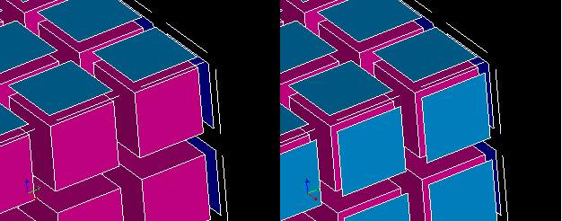

.. _make_2dmesh_from_3d_page:

**************************
Generate boundary elements
**************************

This functionality allows to generate mesh elements on the borders of elements of a higher dimension, for example, to create 2D elements around a block of 3D elements as in the following figure.

.. centered::
	"Missing 2D elements were generated"

**To generate border elements:**

#. Select a mesh or group in the Object Browser or in the 3D Viewer
#. From the Modification menu choose "Create boundary elements" item, or click "Create boundary elements" button in the toolbar

	.. image:: ../images/2d_from_3d_ico.png
	 	:align: center

	.. centered::
		"Create boundary elements icon"

	The following dialog box will appear:

	.. image:: ../images/2d_from_3d_dlg.png	
		:align: center

	.. centered::
		 "Create boundary elements dialog box".

#. Check in the dialog box one of two radio buttons corresponding to the type of operation you would like to perform.
#. Fill the other fields available in the dialog box.
#. Click the **Apply** or **Apply and Close** button to perform the operation.

"Create boundary elements" dialog allows creation of boundary elements of two types.

* **2D from 3D** creates missing mesh faces on free facets of volume elements
* **1D from 2D** creates missing mesh edges on free edges of mesh faces

Here a **free facet** means a facet shared by only one volume, a **free edge**
means an edge shared by only one mesh face.

In this dialog:

* specify the **Target** mesh, where the boundary elements will be created.
  
	* **This mesh** adds elements in the selected mesh.
	* **New mesh** adds elements to a new mesh. The new mesh appears in the Object Browser with the name that you can change in the adjacent box. 
  
* activate **Copy source mesh** checkbox to copy all elements of the selected mesh to the new mesh, else the new mesh will contain only boundary elements (old and created by this operation).
* activate **Create group** checkbox to create a group to which all the boundary elements (old and new) are added. The new group appears in the Object Browser with the name that you can change in the adjacent box. 

**See Also** a sample TUI Script of a :ref:`tui_make_2dmesh_from_3d` operation.  

