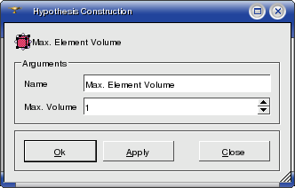

.. _max_element_volume_hypo_page:

*****************************
Max Element Volume hypothesis
*****************************

**Max Element Volume** hypothesis is applied for meshing of 3D objects composing your geometrical object. Definition of this hypothesis consists of setting the **maximum volume** of 3D meshing elements (depending on the chosen meshing algorithm it can be **hexahedrons** or **tetrahedrons**), which will compose the mesh of these 3D objects.

**See Also** a sample TUI Script of a :ref:`tui_max_element_volume` operation.  

