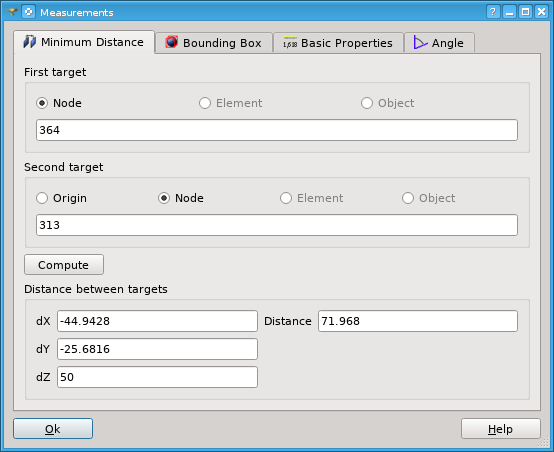
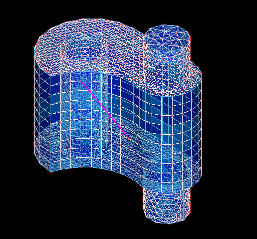
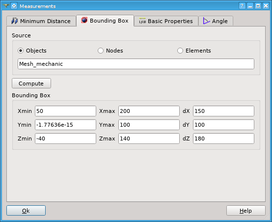
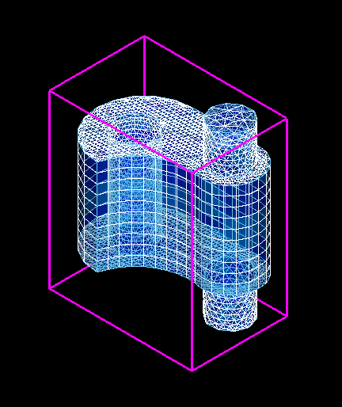
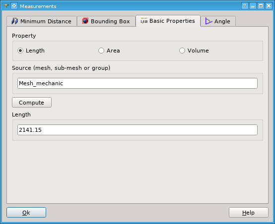
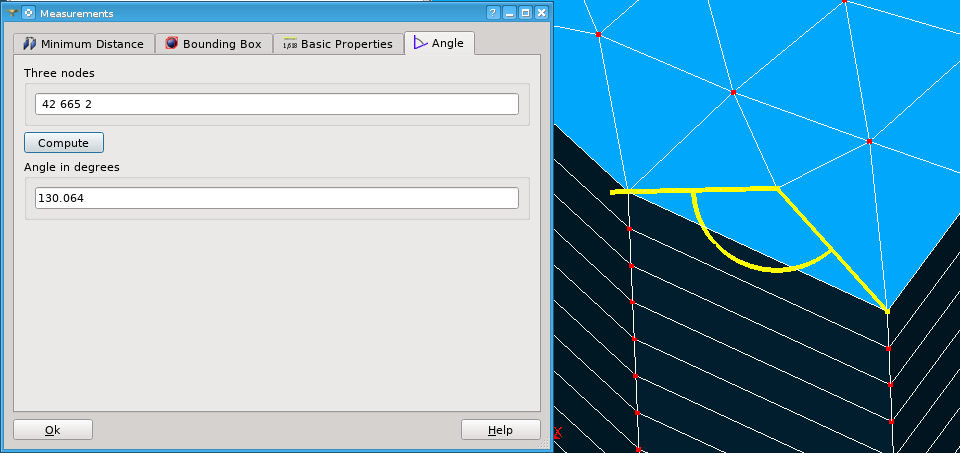

.. _measurements_page:

************
Measurements
************

Mesh module provides the possibility to perform different measurements of the selected mesh data.

All measurement operations are available via **Measurements** top-level menu. Access to the measurements operations is implemented via a single dialog box, where each operation is represented as a separate tab page.

.. _min_distance_anchor:

Minimum Distance
################

This operation allows measuring the distance between two objects. Currently only node-to-node and node-to-origin operations are available, but this operation will be extended in the future to support other mesh objects - elements, meshes, sub-meshes and groups.

To start **Minimum Distance** operation, select **Minimum Distance** tab in **Measurements** dialog.

Choose the first and the second target by switching the corresponding radio buttons, then select the objects the distance between which is to be calculated (or input their IDs directly in case of nodes/elements) and press **Compute** button.

The following targets are supported:

* **Node:** single mesh node;
* **Element:** single mesh element (not available in this version);
* **Object:** mesh, sub-mesh or group object (not available in this version);
* **Origin:** origin of the global co-ordinate system.

The result will be shown in the bottom area of the dialog. In addition, a simple preview will be shown in the 3D viewer.

.. _bounding_box_anchor:

Bounding Box
############

This operation allows calculating the bounding box of the selected object(s).

To start **Bounding Box** operation, select **Bounding Box** tab in **Measurements** dialog.

Choose the required type of the object by switching the corresponding radio button, select the object(s) and press *Compute* button.

The following types of input are available:

* **Objects:** one or several mesh, sub-mesh or group objects;
* **Nodes:** a set of mesh nodes;
* **Elements:** a set of mesh elements.

The result of calculation will be shown in the bottom area of the dialog. In addition, a simple preview will be shown in the 3D viewer.

.. _basic_properties_anchor:

Basic Properties
################

This operation provides calculation of length, area or volume for the the selected object:

* **Length** is calculated as a sum of lengths of all 1D elements;
* **Area** is a sum of areas of all 2D elements
* **Volume** is a sum of volumes of all 3D elements. 

To start a **Basic Properties** calculation, select **Length**, **Area** or **Volume** item.

In the dialog box select the required type of calculation (length, area or volume) and the object (mesh, sub-mesh or group) and press **Compute** button.

The result of calculation will be shown in the bottom area of the dialog.

.. note::
	* If the mesh consists of 3D elements only, its "length" and "area" will be 0.
	* As calculation result is a sum of lengths, areas and volumes of all mesh elements, the duplication is not taken into account; i.e. all duplicated elements (elements built on the same set of nodes) will be included into the result.
	* Similarly, intersection of elements is not taken into account.

.. _angle_anchor:

Angle
#####

This operation measures angle defined by three nodes. The second of the specified nodes is a vertex of angle. 

You can specify nodes either by clicking them in the Viewer or by typing their IDs in **Tree nodes** field. If the nodes are correctly specified, upon pressing **Compute** button the angle measure will be displayed and the angle will be shown in the Viewer.

**See Also** a sample TUI Script of :ref:`tui_measurements_page`.
