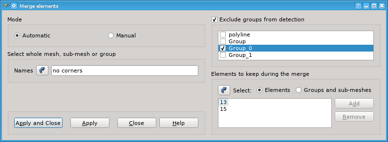
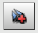
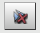
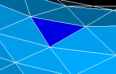

.. _merging_elements_page:

****************
Merging Elements
****************

This functionality allows to merge coincident elements of a mesh. Two elements are considered coincident if they are based on the same set of nodes.

.. centered::
	*"Merge elements"* menu button

To merge elements choose in the main menu **Modification** -> **Transformation** -> **Merge elements** item. The following dialog box shall appear:

In this dialog:

	* **Names** contains names of the selected mesh objects whose elements will be merged.
	* **Automatic** or **Manual** Mode allows choosing how the elements are processed. In the **Automatic** Mode all elements created on the same nodes will be merged. In **Manual** mode you can adjust groups of coincident elements detected by the program.
	* **Exclude groups from detection** group allows to ignore the elements which belong to the specified mesh groups. This control is active provided that the mesh includes groups.
	* **Elements to keep during the merge** group allows to specify elements to keep in the mesh. (By default an element being the first in a group of coincident elements is kept.) It is possible to either select elements in the Viewer or select groups whose elements will be kept.
  
		* *Selection* button activates selection of elements to keep.
		* **Elements** button activates selection of elements in the Viewer.
		* **Groups and sub-meshes** button activates selection of groups and sub-meshes.
		* **Add** button adds selected elements or groups to the list.
		* Elements or groups selected in the list can be removed using **Remove** button.

	  If the **Manual** Mode is selected, additional controls are available:

		.. image:: ../images/mergeelems.png
			:align: center
     
		              	   
		* **Detect** button generates the list of coincident elements found in the selected object.
		* **Coincident elements** is a list of groups of elements for merging. After the operation all elements of each group will be united into one element. The first element of a group is kept and the others are removed.
		* **Remove** button deletes the selected group from the list.
		* **Add** button adds to the list a group of elements selected in the viewer with pressed "Shift" key.
		* **Select all** check-box selects all groups.
		* **Show double elements IDs** check-box shows/hides identifiers of elements of the selected groups in the 3D viewer.
		* **Edit selected group of coincident elements** list allows editing the selected group:
    
			* |ad| adds to the group the elements selected in the viewer.
			* |rm| removes the selected elements from the group.
			* |mv| moves the selected element to the first position in the group in order to keep it in the mesh.
    
  

	* To confirm your choice click **Apply** or **Apply and Close** button.

In the following picture you see a triangle which coincides with one of the elements of the mesh. After we apply **Merge Elements** functionality, the triangle will be completely merged with the mesh.

**See Also** a sample TUI Script of a :ref:`tui_merging_elements` operation.

