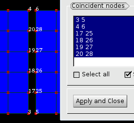
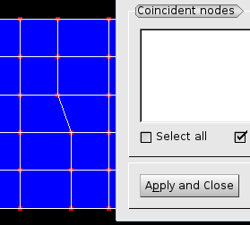

.. _merging_nodes_page:

*************
Merging nodes
*************

This functionality allows user to detect groups of coincident nodes with specified tolerance; each group of the coincident nodes can be then converted to the single node.

.. centered::
	*"Merge nodes"* menu button

*To merge nodes of your mesh:*

#. Choose **Modification** -> **Transformation** -> **Merge nodes** menu item. The following dialog box shall appear:

	.. image:: ../images/mergenodes_auto.png
		:align: center

	* **Name** is the name of the mesh whose nodes will be merged.
	* **Automatic** or **Manual** mode allows choosing how the nodes are processed. In **Manual** mode you can adjust groups of coincident nodes detected by the program and/or select any nodes to be merged.
	* **Tolerance** is a maximum distance between nodes sufficient for merging.
	* Activation of **No merge of corner and medium nodes of quadratic cells** check-box prevents merging medium nodes of quadratic elements with corner nodes. This check-box is enabled provided that the selected mesh includes quadratic elements.
	* Activation of **Avoid making holes** check-box prevents merging nodes that make elements invalid (but not degenerated) and hence removed. Thus, no holes in place of removed elements appear. 
	* **Exclude groups from detection** group allows to ignore the nodes which belong to the specified mesh groups. This control is active provided that the mesh includes groups.
	* **Nodes to keep during the merge** group allows to specify nodes to keep in the mesh. (By default a node being the first in a group of coincident nodes is kept.) It is possible to either select nodes in the Viewer or select groups of any element type whose nodes will be kept.
  
		* *Selection* button activates selection of nodes to keep.
		* **Nodes** button activates selection of nodes in the Viewer.
		* **Groups and sub-meshes** button activates selection of groups and sub-meshes.
		* **Add** button adds selected nodes or groups to the list.
		* Nodes or groups selected in the list can be removed using **Remove** button.

#. **Automatic mode:**

	* In the **Automatic** Mode all nodes within the indicated tolerance will be merged. The nodes which belong to the groups specified in **Exclude groups from detection** will NOT be taken into account.

#. The **Manual** mode gives you full control of what the operation will do. In this mode additional controls are available:

	* **Detect** button generates the list of coincident nodes for the given **Tolerance**.
	* **Coincident nodes** is a list of groups of nodes for merging. Upon **Apply** all nodes of each group will be united into one node. The first node of a group is kept and the others are removed. By default the first node has a lowest ID within the group.

		* **Remove** button deletes the selected group from the list.
		* **Add** button adds to the list a group of nodes selected in the viewer.
		* **Select all** check-box selects all groups.
		* **Show double nodes IDs** check-box shows/hides identifiers of nodes of selected groups in the 3D viewer.

	.. image:: ../images/mergenodes.png
		:align: center

	* **Edit selected group of coincident nodes** list allows editing the selected group:
    
          .. image:: ../images/add.png
             :align: center

	  * adds to the group the nodes selected in the viewer.
    
          .. image:: ../images/remove.png
             :align: center

	  * removes from the group the selected nodes.
    
          .. image:: ../images/sort.png
             :align: center

	  * moves the selected node to the first position in the group in order to keep it in the mesh.

#. To confirm your choice click **Apply** or **Apply and Close** button.

   The initial object. Nodes 25, 26 and 5 are added to **Nodes to keep during the merge** group.

   The object has been merged

**See Also** a sample TUI Script of a :ref:`tui_merging_nodes` operation.  

