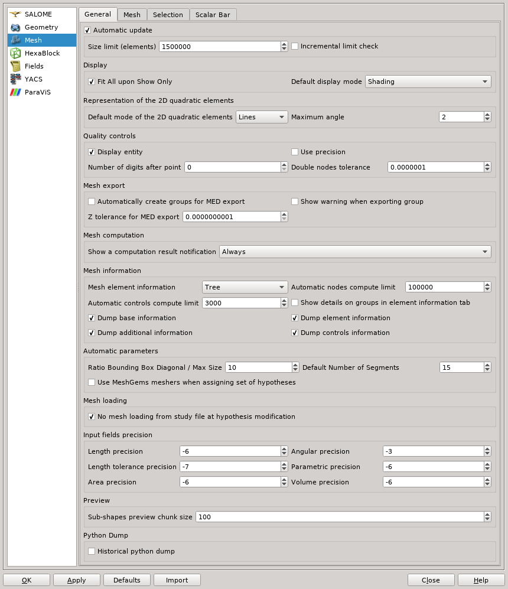
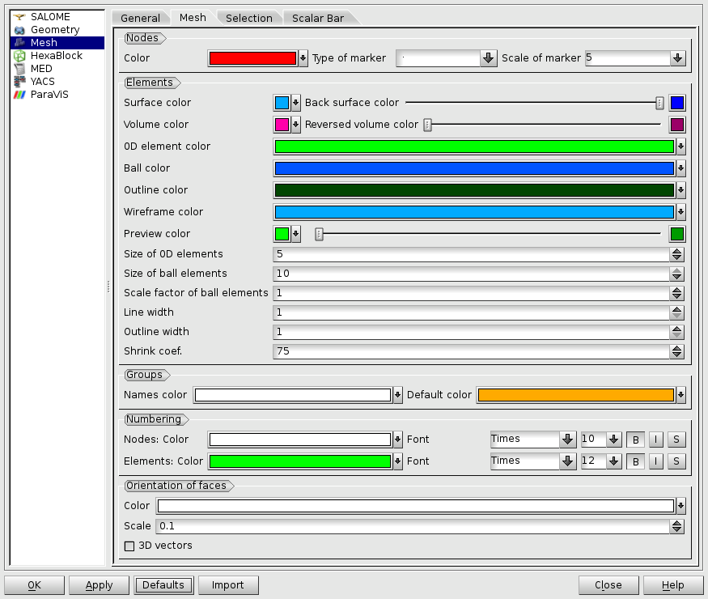
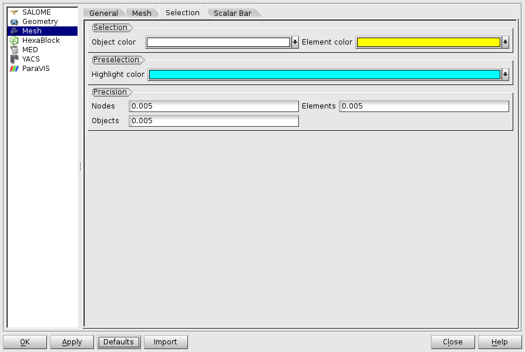
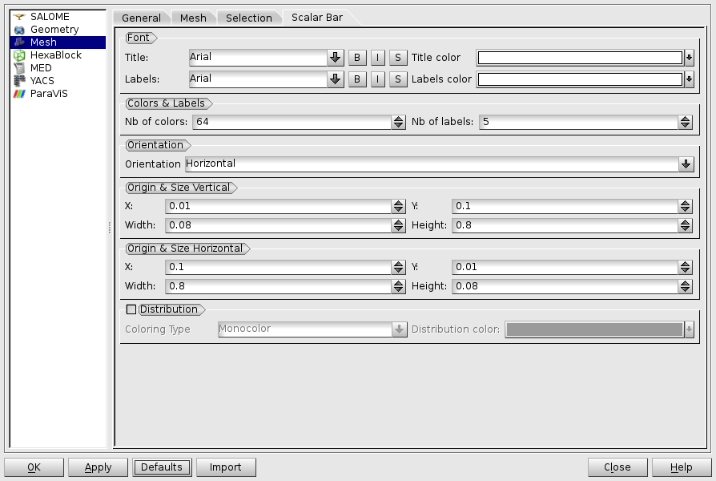

.. _mesh_preferences_page:

****************
Mesh preferences
****************

In the Mesh module you can set mesh preferences, which can be used right now or in later sessions with this module according to the preferences.

General Preferences
###################

.. _automatic_update_pref:

* **Automatic Update**

  * **Automatic Update** - if activated, the mesh in your viewer will be automatically updated after it's computation, depending on values of additional preferences specified below.
  * **Size limit (elements)** - allows specifying the maximum number of elements in the resulting mesh for which the automatic updating of the presentation is performed. This option affects only :ref:`Compute <compute_anchor>` operation. Zero value means "no limit". Default value is 500 000 mesh elements. 
  * **Incremental limit check** - if activated, the mesh size limit check is not applied to the total number of elements in the resulting mesh, it is applied iteratively to each entity type in the following order: 0D elements, edges, faces, volumes, balls. At each step the number of entities of a certain type is added to the total number of elements computed at the previous step - if the resulting number of elements does not exceed the size limit, the entities of this type are shown, otherwise the user is warned that some entities are not shown.

.. _display_mode_pref:

* **Display mode**

  * **Default display mode** - allows to set Wireframe, Shading, Nodes or Shrink :ref:`presentation mode <display_mode_page>` as default.

.. _quadratic_2d_mode_pref:

* **Representation of the 2D quadratic elements**

  * **Default mode of the 2D quadratic elements** - allows to select either *Lines* or *Arcs* as a default :ref:`representation <quadratic_2d_mode>` of 1D and 2D :ref:`quadratic elements <adding_quadratic_elements_page>`.
  * **Maximum Angle** - maximum deviation angle used by the application to build arcs.

* **Quality Controls**

  * **Display entity** - if activated, only currently :ref:`controlled <quality_page>` entities are displayed in the viewer and other entities are temporarily hidden. For example if you activate :ref:`Length <length_page>` quality control, which controls the length of mesh segments, then only mesh segments are displayed and faces and volumes are hidden. 
  * **Use precision** - if activated, all quality controls will be computed at precision defined by **Number of digits after point** - as integers by default.

.. _dbl_nodes_tol_pref:

  * **Double nodes tolerance** - defines the maximal distance between two mesh nodes, at which they are considered coincident by :ref:`Double nodes <double_nodes_control_page>` quality control. This value is also used in :ref:`Quality Info <mesh_quality_info_anchor>` tab page of :ref:`Mesh Information <mesh_infos_page>` dialog.

* **Mesh export**

.. _export_auto_groups_pref:

  * **Automatically create groups for MED export** - defines a default state of a corresponding check-box in :ref:`MED Export <export_auto_groups>` dialog.

.. _group_export_warning_pref:

  * **Show warning when exporting group** - if activated, a warning is displayed when exporting a group.

.. _show_comp_result_pref:

* **Mesh computation**

  * **Show a computation result notification** - allows to select the notification mode about a :ref:`mesh computation <compute_anchor>` result. There are 3 possible modes:
		* **Never** - not to show the :ref:`result dialog <meshing_result_anchor>` at all;
		* **Errors only** - the result dialog will be shown if there were some errors during a mesh computation;
		* **Always** - show the result dialog after each mesh computation. This is a default mode.

.. _mesh_information_pref:

* **Mesh information**

  * **Mesh element information** - allows changing the way :ref:`mesh element information <mesh_element_info_anchor>` is shown:
		* **Simple** - as a plain text
		* **Tree** - in a tree-like form

.. _nb_nodes_limit_pref:

  * **Automatic nodes compute limit** - allows defining the size limit for the :ref:`mesh groups <mesh_addition_info_group_anchor>` for which the number of underlying nodes is calculated automatically. If the group size exceeds the value set in the preferences, the user will have to press \em Compute button explicitly. Zero value means "no limit". By default the value is set to 100 000 mesh elements.

.. _auto_control_limit_pref:

  * **Automatic controls compute limit** - allows defining a maximal number of mesh elements for which the quality controls in the :ref:`Quality Information <mesh_quality_info_anchor>` tab page are calculated automatically. If the number of mesh elements exceeds the value set in the preferences, it is necessary to press **Compute** button explicitly to calculate a quality measure. Zero value means "no limit". By default the value is set to 3 000 mesh elements.

.. _group_detail_info_pref:

  * **Show details on groups in element information tab** - when this option is switched off (default), only the names of groups, to which the node or element belongs, are shown in the :ref:`Element Info <mesh_element_info_anchor>` tab of "Mesh Information" dialog box. If this option is switched on, the detailed information on groups is shown.
  * **Dump base information** - allows dumping base mesh information to the file, see :ref:`Mesh Information <dump_mesh_infos>`.
  * **Dump element information** - allows dumping element information to the file, see :ref:`Mesh Information <dump_mesh_infos>`.
  * **Dump additional information** - allows dumping additional mesh information to the file, see :ref:`Mesh Information <dump_mesh_infos>`.
  * **Dump controls information** - allows dumping quality mesh information to the file, see :ref:`Mesh Information <dump_mesh_infos>`.

* **Automatic Parameters**

.. _diagonal_size_ratio_pref:
	
  * **Ratio Bounding Box Diagonal / Max Size** - defines the ratio between the bounding box of the meshed object and the Max Size of segments. It is used as a default value of :ref:`1D Meshing Hypotheses <a1d_meshing_hypo_page>` defining length of segments, especially by :ref:`Max Size <max_length_anchor>` hypothesis.

.. _nb_segments_pref:

  * **Default Number of Segments** - defines the default number of segments in :ref:`Number of Segments <number_of_segments_anchor>` hypothesis.

* **Mesh loading**

  * **No mesh loading from study file at hypothesis modification** - if activated, the mesh data will not be loaded from the study file when a hypothesis is modified. This allows saving time by omitting loading data of a large mesh that is planned to be recomputed with other parameters.

* **Input fields precision** - allows to adjust input precision of different parameters. The semantics of the precision values is described in detail in **Using input widgets** chapter of GUI documentation (Introduction to Salome Platform / Introduction to GUI / Using input widgets). In brief: **positive** precision value is the maximum allowed number of digits after the decimal point in the fixed-point format; **negative** precision value is the maximum allowed number of significant digits in mantissa in either the fixed-point or scientific format.

  * **Length precision** - allows to adjust input precision of coordinates and dimensions.
  * **Angular precision** - allows to adjust input precision of angles.
  * **Length tolerance precision** - allows to adjust input precision of tolerance of coordinates and dimensions.
  * **Parametric precision** - allows to adjust input precision of parametric values.
  * **Area precision** - allows to adjust input precision of mesh element area.
  * **Volume precision** - allows to adjust input precision of mesh element volume.

* **Preview**

.. _chunk_size_pref:

  * **Sub-shapes preview chunk size** - allows to limit the number of previewed sub-shapes shown in the hypotheses creation dialog boxes, for example "Reverse Edges" parameter of :ref:`Number of Segments <number_of_segments_anchor>` hypothesis.

* **Python Dump**

  * **Historical python dump** - allows switching between *Historical* and *Snapshot* dump mode:

    * In *Historical* mode, Python Dump script includes all commands performed by SMESH engine.
    * In *Snapshot* mode, the commands relating to objects removed from the Study as well as the commands not influencing the current state of meshes are excluded from the script.

.. _mesh_tab_preferences:

Mesh Preferences
################

**Mesh** tab page contains parameters defining the way the mesh is displayed in the 3D Viewer.

* **Nodes** - allows to define default parameters for nodes, which will be applied for a newly created mesh only. Existing meshes can be customized using :ref:`Properties dialog box <colors_size_page>` available from the context menu of a mesh.

  * **Color** -  allows to select the color of nodes. Click on the downward arrow near the colored line to access to the **Select Color** dialog box.
  * **Type of marker** - allows to define the shape of nodes.
  * **Scale of marker** - allows to define the size of nodes.

* **Elements** - allows to define default parameters for different elements, which will be applied to a newly created mesh only. Existing meshes can be customized using :ref:`Properties dialog box <colors_size_page>` available from the context menu of a mesh.

  * **Surface color**  - allows to select the surface color of 2D elements (seen in Shading mode). Click on the downward arrow near the colored line to access to the **Select Color** dialog box.
  * **Back surface color** - allows to select the back surface color of 2D elements. This is useful to differ 2d elements with reversed orientation. Use the slider to select the color generated basing on the **Surface color** by changing its brightness and saturation.
  * **Volume color** - allows to select the surface color of 3D elements (seen in Shading mode).
  * **Reversed volume color** - allows to select the surface color of reversed 3D elements. Use the slider to select the color generated basing on the **Volume color** by changing its brightness and saturation.
  * **0D element color** - allows to choose color of 0D mesh elements.
  * **Ball color** - allows to choose color of discrete mesh elements (balls).
  * **Outline color** - allows to select the color of element borders.
  * **Wireframe color** - allows to select the color of borders of elements in the wireframe mode.
  * **Preview color** - allows to select the preview color of the elements, which is used while :ref:`manual creation of elements <adding_nodes_and_elements_page>`.
  * **Size of 0D elements** - specifies default size of 0D elements.
  * **Size of ball elements** - specifies default size of discrete elements (balls).
  * **Scale factor of ball elements** - specifies default scale factor of discrete elements (balls) allowing to adjust their size in the Viewer.
  * **Line width** - allows to define the width of 1D elements (segments).
  * **Outline width** - allows to define the width of borders of 2D and 3D elements (shown in the Shading mode).
  * **Shrink coef.** - allows to define relative size of a shrunk element compared a non-shrunk element in percents in the shrink mode.

* **Groups**

  * **Names color** - specifies color of group names to be used in the 3D viewer.
  * **Default color** - specifies the default group color, which is used to create a new mesh group (see :ref:`Create Group dialog box <creating_groups_page>`).

* **Numbering** allows to define properties of numbering functionality:

  * **Nodes** - specifies text properties of nodes numbering (font family, size, attributes, color).
  * **Elements** - same for elements.

* **Orientation of Faces** - allows to define default properties of orientation vectors. These preferences will be applied to the newly created meshes only; properties of existing meshes can be customized using :ref:`Properties dialog box <colors_size_page>` available from the context menu of a mesh.

  * **Color** - allows to define the color of orientation vectors;
  * **Scale** - allows to define the size of orientation vectors;
  * **3D Vector** - allows to choose between 2D planar and 3D vectors.

Selection Preferences
#####################

* **Selection** - performed with mouse-indexing (preselection) and left-clicking on an object, whose appearance changes as defined in the **Preferences**.

  * **Object color** - allows to select the color of mesh (edges and borders of meshes) of the selected entity. Click on the colored line to access to the **Select Color** dialog box.
  * **Element color** - allows to select the color of surface of selected elements (seen in Shading mode). Click on the colored line to access to the **Select Color** dialog box.

* **Preselection** - performed with mouse-indexing on an object, whose appearance changes as defined in the **Preferences**.

  * **Highlight color** - allows to select the color of mesh (edges and borders of meshes) of the entity. Click on the colored line to access to the **Select Color** dialog box.

* **Precision** - in this menu you can set the value of precision used for **Nodes**, **Elements** and **Objects**.

Scalar Bar Preferences
######################

.. note::
	The following settings are default and will be applied to a newly created mesh only. Existing meshes can be customized using local :ref:`Scalar Bar Properties dialog box <scalar_bar_dlg>` available from the context menu of a mesh.

* **Font** - in this menu you can set type, face and color of the font of **Title** and **Labels**.

* **Colors & Labels** - in this menu you can set the **number of colors** and the **number of labels** in use.

* **Orientation** - here you can choose between vertical and horizontal orientation of the **Scalar Bar**.

* **Origin & Size Vertical & Horizontal** - allows to define placement (**X** and **Y**) and lookout (**Width** and **Height**) of Scalar Bars.
	* **X** - abscissa of the point of origin (from the left side).
	* **Y** - ordinate of the origin of the bar (from the bottom).

* **Distribution** in this menu you can Show/Hide distribution histogram of the values of the **Scalar Bar** and specify the **Coloring Type** of the histogram:
	* **Multicolor** - the histogram is colored as **Scalar Bar**.
	* **Monocolor** - the histogram is colored as selected with **Distribution color** selector.

