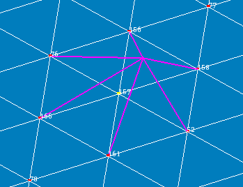
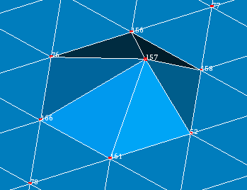

.. _mesh_through_point_page:

************
Moving nodes
************

In mesh you can define a node at a certain point either

* by movement of the node closest to the point or 
* by movement of a selected node to the point.

*To displace a node:*

#. From the **Modification** menu choose the **Move node** item or click *"Move Node"* button in the toolbar.

	.. image:: ../images/image67.png
		:align: center

	.. centered::
		*"Move Node"* button

   The following dialog will appear:

	.. image:: ../images/meshtopass1.png
		:align: center

	.. centered::
		Manual node selection

	.. image:: ../images/meshtopass2.png
		:align: center

	.. centered::
		Automatic node selection

#. Specify the way of node selection: manually (the first radio button) or automatically (the second radio button).
#. If the manual method is selected, select a node to move (X, Y, Z fields show the original coordinates of the node) or type the node ID.
#. Enter the coordinates of the destination point. You can click **Update Destination** button to set the coordinates of the destination point equal to the coordinates of the node to move.
#. Activate **Preview** check-box to show the result of move in the viewer.
#. Click the **Apply** or **Apply and Close** button to confirm the operation.

.. centered::
	The initial mesh

.. centered::
	The modified mesh

**See Also** a sample TUI Script of a :ref:`tui_moving_nodes` operation.  

