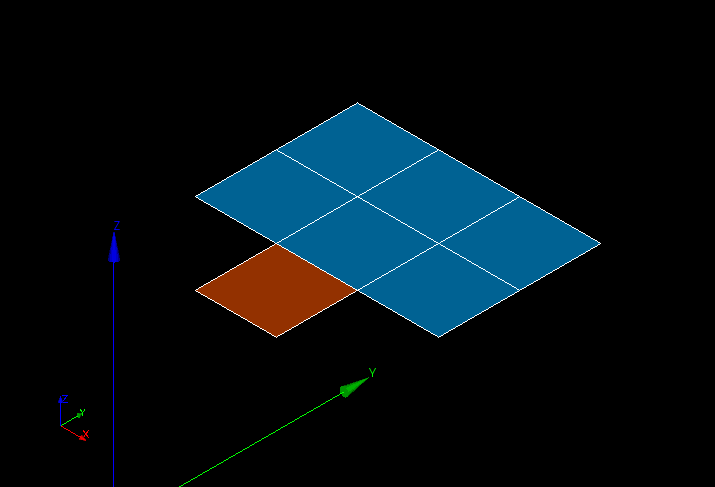

.. _over_constrained_faces_page:

**********************
Over-constrained faces
**********************

This mesh quality control highlights faces sharing only one border with other faces.

.. note::
	The highlighted faces are actually over-constrained only if, at the computation time, the boundary conditions on the borders where the nodes are located are all Dirichlet boundary conditions.

.. centered::
	Over-constrained face is displayed in red

**See Also** a sample TUI Script of a :ref:`tui_over_constrained_faces` filter.  

