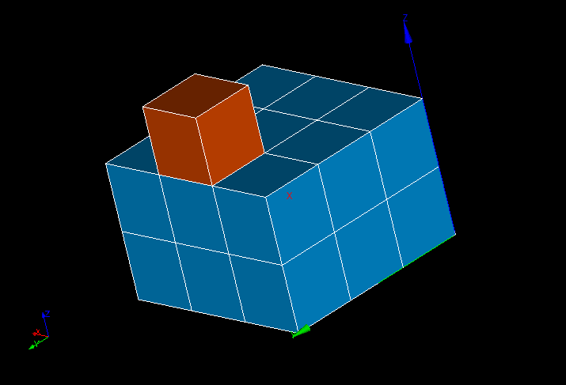

.. _over_constrained_volumes_page:

************************
Over-constrained volumes
************************

This mesh quality control highlights volumes having all their points on the border.

.. note::
	The highlighted volumes are actually over-constrained only if, at the computation time, the boundary conditions on the borders where the nodes are located are all Dirichlet boundary conditions.

.. centered::
	Over-constrained volume is displayed in red.

**See Also** a sample TUI Script of a :ref:`tui_over_constrained_volumes` filter.
