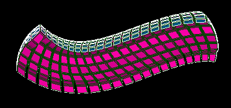
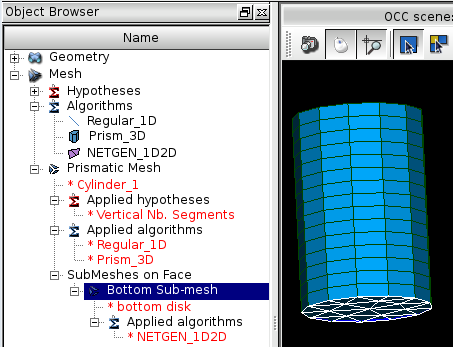
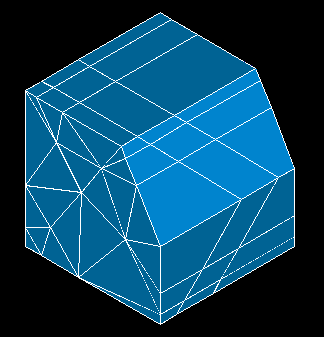

.. _prism_3d_algo_page:

******************************
Extrusion 3D meshing algorithm
******************************

Extrusion 3D algorithm can be used for meshing prisms, i.e. 3D shapes
defined by two opposing faces having the same number of vertices and
edges. These two faces should be connected by quadrangle "side" faces.

.. centered::
	Clipping view of a mesh of a prism with non-planar base and top faces

The prism is allowed to have sides composed of several faces. (A prism
side is a row of faces (or one face) connecting the corresponding edges of
the top and base faces). However, a prism 
side can be split only vertically as indicated in the
picture below. 

.. image:: ../images/prism_ok_ko.png 
	:align: center

.. centered::
	A suitable and an unsuitable prism

In this picture, the left prism is suitable for meshing with 3D
extrusion algorithm: it has six sides, two of which are split
vertically. The right prism cannot be meshed with this
algorithm because one of the prism sides is split horizontally (the
splitting edge is highlighted).

The algorithm can propagate 2D mesh not only between horizontal
(i.e. base and top) faces of one prism but also between faces of prisms
organized in a stack and between stacks sharing prism sides.

.. _prism_stacks:

.. image:: ../images/prism_stack.png 
	:align: center

.. centered::
	Prism stacks

This picture shows four neighboring prism stacks, each comprising two prisms.
The shown sub-mesh is used by the algorithm to mesh
all eight prisms in the stacks.

To use *Extrusion 3D* algorithm you need to assign algorithms
and hypotheses of lower dimensions as follows.
(A sample picture below shows algorithms and hypotheses used to
mesh a cylinder with prismatic volumes).

The **Global** algorithms and hypotheses to be chosen at 
:ref:`create_mesh_anchor` are:

* 1D algorithm and hypothesis that will be applied for meshing (logically) vertical edges of the prism (which connect the top and the base faces of the prism). In the sample picture above these are "Regular_1D" algorithm and "Number of Segments" hypothesis named "Vertical Nb. Segments".

The **Local** algorithms and hypotheses to be chosen at 
:ref:`constructing_submeshes_page` are:

* 1D and 2D algorithms and hypotheses that will be applied for meshing the top and the base prism :ref:`faces <submesh_shape_section>`. These faces can be meshed with any type of 2D elements: quadrangles, triangles, polygons or their mix. It is enough to define a sub-mesh on either the top or the base face. In the sample picture above, "NETGEN_1D2D" algorithm meshes "bottom disk" face with triangles. (1D algorithm is not assigned as "NETGEN_1D2D" does not require divided edges to create a 2D mesh.)
  
* Optionally you can define a 1D sub-mesh on some vertical :ref:`edges <submesh_shape_section>` of stacked prisms, which will override the global 1D hypothesis mentioned above. In the :ref:`Prism stacks <prism_stacks>` picture, the vertical division is not equidistant on the whole length because a "Number Of Segments" hypothesis with Scale Factor=3 is assigned to the highlighted edge.

If *Extrusion 3D* algorithm is assigned to a sub-mesh in a mesh
with multiple sub-meshes, the described above approach may not work as
expected. For example the bottom face may be meshed by other algorithm
before *Extrusion 3D* have a chance to project a mesh from the
base face. This thing can happen with vertical edges as well. All
these can lead to either a meshing failure or to an incorrect meshing.
In such a case, it's necessary to explicitly define algorithms
that *Extrusion 3D* implicitly applies in a simple case:

* assign :ref:`projection_1D2D` algorithm to the top face and
* assign a 1D algorithm to a group of all vertical edges.

.. centered::
	Prism with Extrusion 3D meshing. Vertical division is different on neighbor edges because several local 1D hypotheses are assigned

**See Also** a sample TUI Script of :ref:`tui_prism_3d_algo`.

