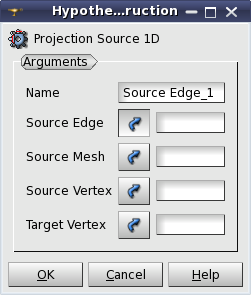
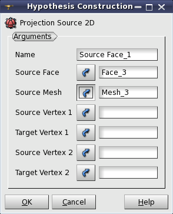
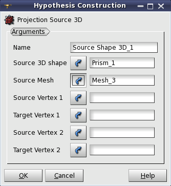

.. _projection_algos_page:

*********************
Projection Algorithms
*********************

.. contents:: `Table of contents`

Projection algorithms allow to define the mesh of a geometrical
object by the projection of another already meshed geometrical object.

.. note::
	Source and target geometrical objects mush be topologically equal, i.e. they must have same number of sub-shapes, connected to corresponding counterparts.

.. centered::
	Topologically equal faces suitable for 2D projection.

.. _projection_1D:

Projection 1D
=============

**Projection 1D** algorithm allows to define the mesh of an edge (or group of edges)
by the projection of another already meshed edge (or group of edges).

To apply this algorithm select the edge to be meshed (indicated in
the field **Geometry** of **Create mesh** dialog box),
**Projection1D** in the list of 1D algorithms and click the
**"Add Hypothesis"** button.
The following dialog box will appear:

In this dialog you can define

* the **Name** of the algorithm,
* the already meshed **Source Edge** and 
* the **Source Mesh** (It can be omitted only when projecting a sub-mesh on another one of the same Mesh).
* It could also be necessary to define the orientation of edges,  which is done by indicating the **Source Vertex** being the first point of the **Source Edge **and the **Target Vertex** being the first point of the edge being meshed.

For a group of edges, **Source** and **Target** vertices should be
shared by only one edge of the group. If **Source** and **Target**
vertices are specified, the edges in the group must be connected.
The source and target groups must contain equal number of edges
and they must form topologically equal structures.

.. _projection_2D:

Projection 2D
=============

**Projection 2D** algorithm allows to define the mesh of a face
(or group of faces) by the projection of another already meshed face
(or group of faces). This algorithm works only if all edges of the
target face have been discretized into the same number of
segments as corresponding edges of the source face.

To apply this algorithm select the face to be meshed (indicated in the
field **Geometry** of **Create mesh** dialog box), **Projection
2D** in the list of 2D algorithms and click the **"Add Hypothesis"** button. The following dialog box will appear:

In this dialog you can define 

* the **Name** of the algorithm, 
* the already meshed **Source Face** and 
* the **Source Mesh** (It can be omitted only when projecting a submesh on another one of the same Mesh). 
* It could also be necessary to define the orientation of mesh on the face, which is done by indicating two **Source Vertices**, which belong to the same edge of the **Source Face**, and two **Target Vertices**, which belong to the same edge of the face being meshed.

The groups of faces are suitable for this algorithm only if they
contain an equal number of faces and form topologically equal
structures.

.. _projection_1D2D:

Projection 1D-2D
================

**Projection 1D-2D** algorithm differs from
:ref:`projection_2D` algorithm in one aspect: it generates mesh segments
on edges of the face according to the projected 2D elements; thus it
does not require the edges to be meshed by any other 1D algorithm;
moreover it does not allow to mesh edges of the face using another
algorithm via definition of sub-meshes.

.. _projection_3D:

Projection 3D
=============

**Projection 3D** algorithm allows to define the mesh of a shape by
the projection of another already meshed shape.  This algorithm works
only if all faces and edges of the target shape have been meshed as 1D-2D
Projections of the faces and edges of the source shape. Another
limitation is that this algorithm currently works only on boxes.

To apply this algorithm select the solid to be meshed (indicated in
the field **Geometry** of **Create mesh** dialog box), **Projection 3D** 
in the list of 3D algorithms and click the  button. The
following dialog box will appear:

In this menu you can define the **Name** of the algorithm, the already
meshed source **3D shape** and the **Mesh** (It can be omitted only when 
projecting a submesh on another one from the same global Mesh). 
It could also be necessary to define the orientation of mesh on the shape, which is
done by indicating two **Source Vertices**, which belong to the same edge
of the source **3D Shape**, and two **Target Vertices**, which belong to the
same edge of the source **3D Shape**.

**See Also** a sample TUI Script of a 
:ref:`tui_projection`.

