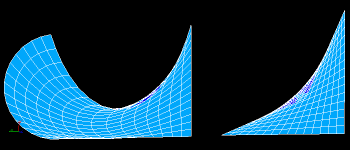
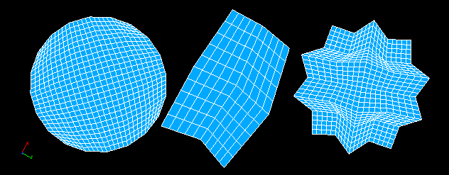

.. _quad_ijk_algo_page:

*************************************
Quadrangle: Mapping meshing algorithm
*************************************

**Quadrangle: Mapping** meshing algorithm is intended for creating
all-quadrangle and quad-dominant meshes on faces without holes and
bound by at least three edges.

The algorithm can create mesh on any face but its quality and
validity depend on two factors:

* face shape (number of edges and boundary concavity);
* discretization of edges.

.. centered::
	"Invalid mesh on quadrilateral concave faces"

The algorithm uses *Transfinite Interpolation* technique in the 
parametric space of a face to locate nodes inside the face.

The algorithm treats any face as quadrangle. If a face is bound by
more than four edges, four most sharp vertices are considered as
corners of the quadrangle and all edges between these vertices are
treated as quadrangle sides. In the case of three edges, the vertex
specified by the user is considered as a fourth degenerated side of the
quadrangle.

.. centered::
	Algorithm generates a structured mesh on complex faces provided that edges are properly discretized

To get an all-quadrangle mesh you have to carefully define 1D
hypotheses on edges of a face. To get a **structured** mesh you have to provide
equal number of segments on opposite sides of the quadrangle. If this
condition is not respected, the algorithm by default (without a 
hypothesis) creates a **quad-dominant** mesh with triangles located near the
side with the maximal number of segments. However, you can get an
**all-quadrangle** mesh in this case by using 
:ref:`hypo_quad_params_anchor` hypothesis to specify how to make transition mesh between opposite
sides with different number of segments, provided that certain
conditions are respected. In any case the total number of segments must be
even. To use *Reduced* transition method, there must be an equal number
of segments on one pair of opposite sides.

The following hypotheses help to create quadrangle meshes. 

* :ref:`Propagation <propagation_anchor>` additional 1D hypotheses help to get an equal number of segments on the opposite sides of a quadrilateral face.
* :ref:`Composite Side Discretization <a1d_algos_anchor>` algorithm is useful to discretize several C1 continuous edges as one quadrangle side.
