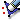

.. _removing_nodes_and_elements_page:

***************************
Removing nodes and elements
***************************

In MESH you can remove nodes and all types of cells of your mesh.

* :ref:`removing_nodes_anchor`
* :ref:`removing_orphan_nodes_anchor`
* :ref:`removing_elements_anchor`
* :ref:`clear_mesh_anchor`

.. _removing_nodes_anchor:

Removing nodes
##############

**To remove a node:**

#. Select your mesh in the Object Browser or in the 3D viewer.
#. From the **Modification** menu choose **Remove** and from the associated submenu select the **Nodes**, or just click *"Remove nodes"* button |rmn| in the toolbar.
   The following dialog box will appear:

	.. image:: ../images/removenodes.png
		:align: center

   In this dialog box you can specify one or several nodes:

   * choose mesh nodes with the mouse in the 3D Viewer. It is possible to select a whole area with a mouse frame; or 
   * input the node IDs directly in **ID Elements** field. The selected nodes will be highlighted in the viewer; or
   * apply Filters. **Set filter** button allows to apply a filter to the selection of nodes. See more about filters in the :ref:`selection_filter_library_page` page.

#. Click **Apply** or **Apply and Close** to confirm deletion of the specified nodes.

.. note::
	Be careful while removing nodes because if you remove a definite node of your mesh all adjacent elements will be also deleted.

.. _removing_orphan_nodes_anchor:

Removing orphan nodes
#####################

There is a quick way to remove all orphan (free) nodes.

*To remove orphan nodes:*

#. Select your mesh in the Object Browser or in the 3D viewer.
#. From the **Modification** menu choose **Remove** and from the associated submenu select **Orphan Nodes**, or just click *"Remove orphan nodes"* button |rmon| in the toolbar.
   The following Warning message box will appear:

	.. image:: ../images/removeorphannodes.png
		:align: center

#. Confirm nodes removal by pressing "Yes" button.

.. _removing_elements_anchor:

Removing elements
#################

*To remove an element:*

#. Select your mesh in the Object Browser or in the 3D viewer.
#. From the **Modification** menu choose **Remove** and from the associated submenu select the **Elements**, or just click *"Remove elements"* button |rme| in the toolbar.

   The following dialog box will appear:

	.. image:: ../images/removeelements.png
		:align: center

   In this dialog box you can specify one or several elements:

   * choose mesh elements with the mouse in the 3D Viewer. It is possible to select a whole area with a mouse frame; or 
   * input the element IDs directly in **ID Elements** field. The selected elements will be highlighted in the viewer; or
   * apply Filters. **Set filter** button allows to apply a filter to the selection of elements. See more about filters in the :ref:`selection_filter_library_page` page.

#. Click **Apply** or **Apply and Close** to confirm deletion of the specified elements.

.. centered::
	The initial mesh

.. centered::
	The mesh with some elements removed

.. _clear_mesh_anchor:

Clearing Mesh Data
##################

*To remove all nodes and all types of cells in your mesh at once:*

#. Select your mesh in the Object Browser or in the 3D viewer.
#. From the **Modification** menu choose **Remove** and from the associated submenu select the **Clear Mesh Data**, or just click *"Clear Mesh Data"* button |clr| in the toolbar. You can also right-click on the mesh in the Object Browser and select **Clear Mesh Data** in the pop-up menu.

.. note::
   This command works in a different way in different situations: 
		* if the mesh is computed on a geometry, then *Clear Mesh Data* removes all elements and nodes.
		* if the mesh is not based on a geometry (imported, compound, created from scratch etc.), then *Clear Mesh Data* removes only the elements and nodes computed by algorithms. If no such elements or nodes have been created, can remove nothing.

**See Also** a sample TUI Script of a :ref:`tui_removing_nodes_and_elements` operation.  

