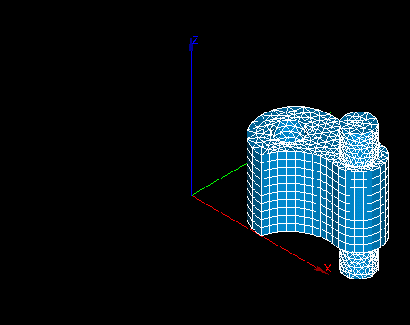
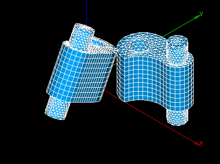

.. _rotation_page:

********
Rotation
********

This operation allows to rotate in space the mesh or some of its elements.

**To rotate the mesh:**

#. From the **Modification** menu choose **Transformation** -> **Rotation** item  or click **"Rotation"** button in the toolbar.
 
	.. image:: ../images/rotation_ico.png 
		:align: center

	.. centered::
		"Rotation button"

	The following dialog will appear:

	.. image:: ../images/rotation.png
		:align: center

#. In this dialog:

	* specify the IDs of the elements which will be rotated:

		* **Select the whole mesh, submesh or group** activating this checkbox; or
		* choose mesh elements with the mouse in the 3D Viewer. It is possible to select a whole area with a mouse frame; or 
		* input the element IDs directly in **ID Elements** field. The selected elements will be highlighted in the viewer; or
		* apply Filters. **Set filter** button allows to apply a filter to the selection of elements. See more about filters in the :ref:`selection_filter_library_page` page.

	* specify the axis of rotation:
		* specify the cooordinates of the start **Point** of the vector of rotation;
		* specify the **Vector** of rotation through the coordinates of its end point with respect to the coordinates of the start point;

	* specify the **Angle** of rotation 

	* specify the conditions of rotation:

		* activate **Move elements** radio button to create  the source mesh (or elements) at the new location and erase it from the previous location;
		* activate **Copy elements** radio button to create the source mesh (or elements) at the new location, but leave it at the previous location, the source mesh will be considered one and single mesh with the result of the rotation;
		* activate **Create as new mesh** radio button to leave the source mesh (or elements) at its previous location and create a new mesh at the new location, the new mesh appears in the Object Browser with the default name MeshName_rotated (it is possible to change this name in the adjacent box);
		* activate **Copy groups** checkbox to copy the groups of elements of the source mesh to the newly created mesh.

	* activate **Preview** checkbox to show the result of transformation in the viewer 
	* click **Apply** or **Apply and Close** button to confirm the operation.

.. centered::
	"The initial mesh"

.. centered::
	"The rotated mesh"

**See Also** a sample TUI Script of a :ref:`tui_rotation` operation.  

