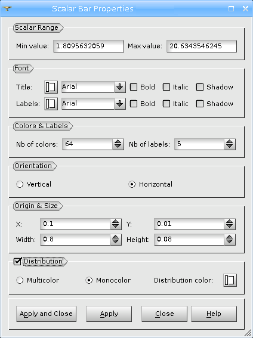

.. _scalar_bar_dlg:

*********************
Scalar Bar properties
*********************

In this dialog you can specify the properties of the scalar bar

* **Scalar Range** - in this menu you can specify **Min value** and **Max value** of the **Scalar Bar**, and turn on/off **Logarithmic** scaling of the scalar bar.

	.. note::
		**Logarithmic scale** is not applicable in case of negative and zero values in the range. In such cases it is disabled.

* **Font** - in this menu you can set type, face and color for the font of **Title** and **Labels** of the **Scalar Bar**

* **Colors & Labels** - in this menu you can set the **number of colors** and the **number of labels** of the **Scalar Bar**

* **Orientation** - allows choosing between vertical and horizontal orientation of the **Scalar Bar**.

* **Origin & Size Vertical & Horizontal** - allows defining the location (**X** and **Y**) and size (**Width** and **Height**) of **Scalar Bar**
	* **X**: abscissa of the origin (from the left side)
	* **Y**: ordinate of the origin (from the bottom)
* **Distribution** - in this menu you can Show/Hide distribution histogram of the values of the **Scalar Bar** and specify histogram properties
	* **Multicolor** the histogram is colored as **Scalar Bar**
	* **Monocolor** the histogram is colored as selected with **Distribution color** selector
