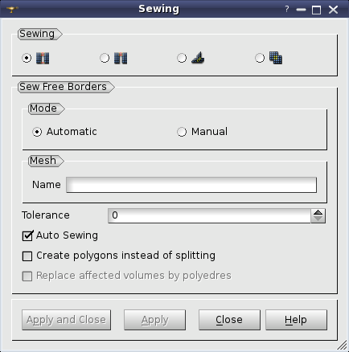
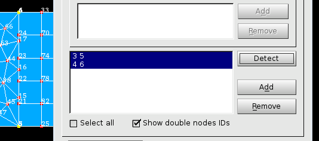
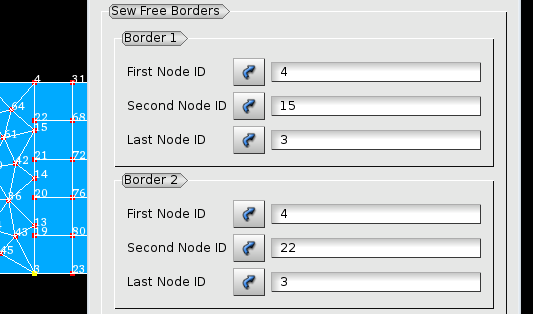
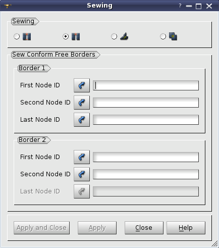
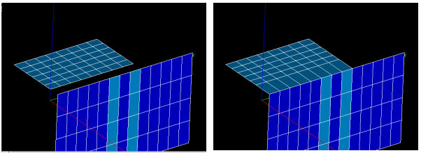
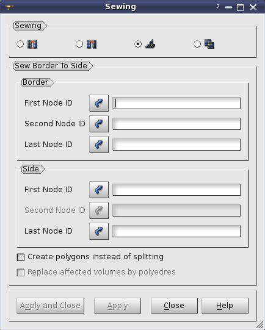
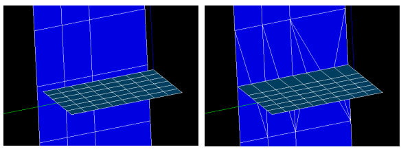
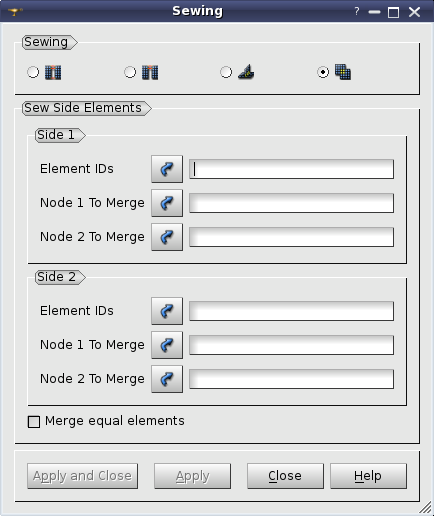
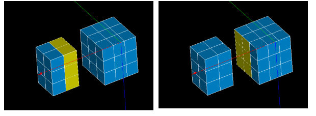
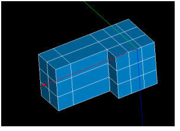

.. _sewing_meshes_page:

*************
Sewing meshes
*************

In SMESH you can sew elements of a mesh. The current functionality allows you to sew:

* :ref:`free_borders_anchor`
* :ref:`conform_free_borders_anchor`
* :ref:`border_to_side_anchor`
* :ref:`side_elements_anchor`

.. centered::
	*"Sewing"* button

*To sew elements of a mesh:*

#. From the **Modification** menu choose the **Transformation** item and from its sub-menu select the **Sewing** item.
#. Check in the dialog box one of the radio buttons corresponding to the type of sewing operation you would like to perform.
#. Fill the other fields available in the dialog box.
#. Click the **Apply** or **Apply and Close** button to perform the operation of sewing.

.. _free_borders_anchor:

Sew free borders
################

This functionality allows you to unite free borders of a 2D mesh.

There are two working modes: *Automatic* and *Manual*.

* In the **Automatic** mode, the program finds free borders coincident within the
  specified tolerance and sews them. Optionally it is possible to
  visually check and correct if necessary the found free borders before
  sewing. 
* In the **Manual** mode you are to define borders to sew by picking
  three nodes of each of two borders.

.. centered::
	Default mode is *Automatic*

To use **Automatic** sewing:

* Specify the mesh you want to sew by selecting it or any its part (group or sub-mesh) in the Object Browser or in the VTK Viewer.
* Specify the **Tolerance**, within which free borders are considered coincident. At the default zero **Tolerance**, the tolerance used by he search algorithm is defined as one tenth of an average size of elements adjacent to compared free borders.
* To visually check the coincident free borders found by the algorithm, switch off **Auto Sewing** check-box. The controls to adjust groups of coincident free borders will become available in the dialog.

	.. image:: ../images/sewing_auto.png
		:align: center

	.. centered::
		Controls to adjust groups of coincident free borders

* **Detect** button launches the algorithm of search of coincident free borders.
* The found groups of **Coincident Free Borders** are shown in the list, one group per line. Each group has its own color, which is used to display the group borders in the VTK Viewer. A free border within a group is designated by the IDs of its first, second and last nodes within parenthesis. All borders present in the list will be sewn upon **Apply**. 
* **Remove** button removes the selected groups from the list.
* **Select All** check-box selects all groups in the list.
* When a group is selected, its borders appear in **Edit Selected Group** list that allows you to change this group.

	.. image:: ../images/sort.png
		:align: center

  * **Set First** button moves the selected border to the first position in the group, as a result other borders will be moved to this border during sewing.

	.. image:: ../images/remove.png
		:align: center

  * **Remove Border** button removes the selected borders from the group. It is active if there are more than two borders in the group.

* Selection of a border in the list allows changing its first and last nodes whose IDs appear in two fields below the list.

  * *Arrow* buttons near each field move the corresponding end node by the number of nodes defined by **Step** field.
 
	.. image:: ../images/swap.png
		:align: center

  * **Swap** button swaps the first and last nodes of a selected border.

For sewing free borders manually you should switch the **Mode** to **Manual** and define three points on each border: the first, the second and the last node:

	.. image:: ../images/sewing_manual.png
		:align: center

* the first node specifies beginning of the border;
* the second node specifies the part of the border which should be considered (as far as the free border usually forms a closed contour);
* the last node specifies the end of the border.

You can select these nodes in the 3D viewer or define by its id.

The first and the second nodes should belong to the same link of a
face. The second and the last nodes of a border can be the same. The
first and the last nodes of two borders can be the same. The
corresponding end nodes of two borders will be merged. Intermediate
nodes of two borders will be either merged or inserted into faces of
the opposite border.

In practice the borders to sew often coincide and in this case it is
difficult to specify the first and the last nodes of a border since
they coincide with the first and the last nodes of the other
border. To cope with this,
:ref:`merge <merging_nodes_page>` coincident nodes into one
beforehand. Two figures below illustrate this approach.

.. centered::
	Merge coincident nodes, which are difficult to distinguish

.. centered::
	After merging nodes it is easy to specify border nodes

The sewing algorithm is as follows:

#. The parameter (U) of each node within a border is computed. So that the first node has U=0.0, the last node has U=1.0, for the rest nodes 0.0 < U < 1.0;
#. Compare node parameters of the two borders. If two nodes of the opposite borders have close parameters, they are merged, i.e. a node of the first border is replaced in all elements by a node of the second border. If a node has no node with a close parameter in the opposite border, it is inserted into an edge of element of the opposite border, an element is split. Two nodes are considered close enough to merge, if difference of their parameters is less than one fifth of minimum length of adjacent face edges on the borders.

	.. image:: ../images/image22.jpg 
		:align: center

	.. centered::
		Sewing free borders

**See Also** a sample TUI Script of a 
:ref:`tui_sew_free_borders` operation.

.. _conform_free_borders_anchor:

Sew conform free borders
########################

This functionality can be used to unite two free borders of a 2D mesh.

The borders of meshes for sewing are defined as for :ref:`free_borders_anchor`
except that the second free border is not limited and can be defined
by the first and the second nodes only. The first nodes of two borders
can be the same.

The algorithm is following: counting nodes starting at the first ones,
the n-th node of the first border is merged with the n-th node of the
other border, until the end of either of borders. Nodes of the first
border are replaced in all elements with corresponding nodes of the
second border.

.. note:: 
	For sewing conform free borders you should define three points on the first border and two points on the second one. User can select these nodes in 3D viewer or define node by its id.

.. centered::
	Sewing conform free borders

**See Also** a sample TUI Script of a 
:ref:`tui_sew_conform_free_borders` operation.

.. _border_to_side_anchor:

Sew border to side
##################

*Sew border to side* is intended to sew a free border to a mesh surface.

The free border is defined as for :ref:`free_borders_anchor`. The place where to sew the border is defined by two nodes, between which the border faces are placed, so that the first border node is merged with the first node on the side and the last node of the border is merged with the second specified node on the side.

The algorithm is following.

#. Find a sequence of linked nodes on the side such that the found links to be most co-directed with the links of the free border.
#. Sew two sequences of nodes using algorithm of :ref:`free_borders_anchor`.

.. note:: 
	For sewing border to side you should define three points on the border and two points on the side. User can select these nodes in 3D viewer or define node by its id.

.. centered::
	Sewing border to side

**See Also** a sample TUI Script of a 
:ref:`tui_sew_meshes_border_to_side` operation.  

.. _side_elements_anchor:

Sew side elements
=================

This operation is intended to unite two mesh surfaces.

Surfaces may be defined by either 2d or 3d elements. The number of
given elements of the sides must be the same. The sets of given
elements must be topologically equal, i.e. each node of one element
set must have a corresponding node in the other element set and
corresponding nodes must be equally linked. If there are 3d elements
in a set, only their free faces must obey to that rule.

Two corresponding nodes on each side must be specified. They must belong to one element and must be located on an element set boundary.

Sewing algorithm finds and merges the corresponding nodes starting
from the specified ones.

.. centered::
	Step-by-step sewing process

.. centered::
	The result of side elements sewing

For sewing side elements you should define elements for sewing and two
nodes for merging on the each side. User can select these elements and
nodes in 3D viewer or define them by its id.

**See Also** a sample TUI Script of a 
:ref:`tui_sew_side_elements` operation.  

