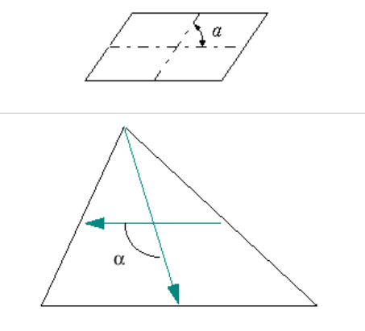

.. _skew_page:

****
Skew
****

**Skew** mesh quality criterion reflects the angle between the lines
that join opposite sides of a quadrangle element or the greatest angle
between a median and a midline in a triangle element. This mesh quality
criterion can be applied to elements composed of 4 and 3 nodes
(quadrangles and triangles).

.. centered::
	**To apply the Skew quality criterion to your mesh:**

#. Display your mesh in the viewer.
#. Choose **Controls > Face Controls > Skew** or click **"Skew"** button of the toolbar.

	.. image:: ../images/image40.png
		:align: center

	.. centered::
		**"Skew" button**

	Your mesh will be displayed in the viewer with its elements colored according to the applied mesh quality control criterion:

	.. image:: ../images/image93.jpg
		:align: center

**See Also** a sample TUI Script of a 
:ref:`tui_skew` operation.  

