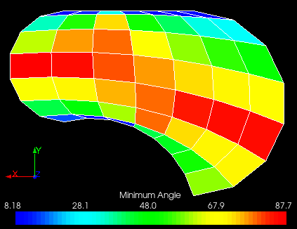

.. _smoothing_page:

*********
Smoothing
*********

Smoothing is used to improve quality of 2D mesh by adjusting the
locations of element corners (nodes). 

.. note:: Depending on the chosen method and mesh geometry the smoothing can actually decrease the quality of elements and even make some elements inverted.

**To apply smoothing to the elements of your mesh:**

#. In the **Modification** menu select the **Smoothing** item or click **"Smoothing"** button in the toolbar.

	.. image:: ../images/image84.png
		:align: center

	.. centered:: 
		**"Smoothing" button**

	The following dialog will appear:

	.. image:: ../images/smoothing.png
		:align: center

#. In this dialog:

	* specify the IDs of the elements which will be smoothed:
		* **Select the whole mesh, sub-mesh or group** activating this   check-box; or
		* choose mesh elements with the mouse in the 3D Viewer. It is possible to select a whole area with a mouse frame; or 
		* input the element IDs directly in **ID Elements** field. The selected elements will be highlighted in the viewer; or
		* apply Filters. **Set filters** button allows to apply a filter to the selection of elements. See more about filters in the :ref:`filtering_elements` page.

	* define the **Fixed nodes ids** that should remain at their location during smoothing. If a mesh is built on a shape, the nodes built on its geometric edges are always fixed. If the smoothing is applied to a part of the mesh (a set of element), the nodes on boundary of the element set are also fixed. It is possible to additionally fix any other nodes. The fixed nodes can be selected manually or by filters, just as the smoothed elements.
	* choose the **Smoothing Method:**
		* **Laplacian** smoothing pulls a node toward the center of surrounding nodes directly connected to that node along an element edge. 
		* **Centroidal** smoothing pulls a node toward the element-area-weighted centroid of the surrounding elements. 

		Laplacian method will produce the mesh with the least element edge length. It is also the fastest method. Centroidal smoothing produces a mesh with more uniform element sizes.

		.. image:: ../images/image83.gif
			:align: center

	* specify the **Iteration limit**. Both smoothing methods iterate through a number of steps to produce the resulting smoothed mesh. At each new step the smoothing is reevaluated with the updated nodal locations. This process continues till the limit of iterations has been exceeded, or till the aspect ratio of all element is less than or equal to the specified one.
	* specify the  **Max. aspect ratio** - the target mesh quality at which the smoothing algorithm should stop the iterations.
	* activate **in parametric space** check-box if it is necessary to improve the shape of faces in the parametric space of geometrical surfaces on which they are generated, else the shape of faces in the 3D space is improved that is suitable for **planar meshes only**. 

#. Click **Apply** or **Apply and Close** button to confirm the operation.

.. centered:: 
	"The initial mesh"

.. centered:: 
	"The smoothed mesh"

**See Also** a sample TUI Script of a 
:ref:`tui_smoothing` operation.  

