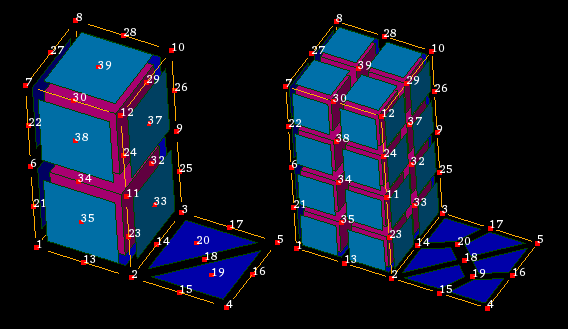

.. _split_biquad_to_linear_page:

******************************
Split bi-quadratic into linear
******************************

This functionality allows to split bi-quadratic elements into
linear ones without creation of additional nodes.

So that

* bi-quadratic triangle will be split into 3 linear quadrangles;
* bi-quadratic quadrangle will be split into 4 linear quadrangles;
* tri-quadratic hexahedron will be split into 8 linear hexahedra;
* quadratic segments adjacent to the split bi-quadratic element will be split into 2 liner segments.

.. centered:: 
	"Mesh before and after splitting"

**To split bi-quadratic elements into linear:**

#. From the **Modification** menu choose the **Split bi-quadratic into linear** item or click **"Split bi-quadratic into linear"** button in the toolbar.

	.. image:: ../images/split_biquad_to_linear_icon.png
		:align: center

	.. centered:: 
		**"Split bi-quadratic into linear" button**

	The following dialog box shall appear:

	.. image:: ../images/split_biquad_to_linear_dlg.png
		:align: center
 

#. Select a mesh, groups or sub-meshes in the Object Browser or in the Viewer.
#. Click the **Apply** or **Apply and Close** button.

**See Also** a sample TUI Script of a :ref:`tui_split_biquad` operation.

