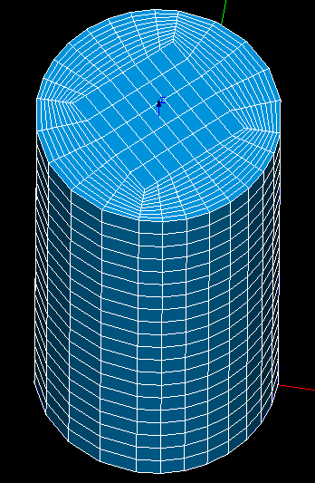

.. _tui_creating_meshes_page:

***************
Creating Meshes
***************

.. contents:: `Table of contents`

First of all see :ref:`example_3d_mesh` which is an example of good python script style for Mesh module.

.. _construction_of_a_mesh:

Construction of a mesh
======================

.. _creating_meshes_ex01.py:

``creating_meshes_ex01.py``

.. literalinclude:: ../../../examples/creating_meshes_ex01.py
    :linenos:
    :language: python

:download:`../../../examples/creating_meshes_ex01.py`

.. _tui_construction_submesh:

Construction of a sub-mesh
==========================

.. _creating_meshes_ex02.py:

``creating_meshes_ex02.py``

.. literalinclude:: ../../../examples/creating_meshes_ex02.py
    :linenos:
    :language: python

:download:`../../../examples/creating_meshes_ex02.py`

.. _change_priority_of_submeshes_in_mesh:

Change priority of sub-meshes in mesh
=====================================

.. _creating_meshes_ex03.py:

``creating_meshes_ex03.py``

.. literalinclude:: ../../../examples/creating_meshes_ex03.py
    :linenos:
    :language: python

:download:`../../../examples/creating_meshes_ex03.py`

.. _tui_editing_while_meshing:

Intermediate edition while meshing
==================================

.. _a3DmeshOnModified2Dmesh.py:

``a3DmeshOnModified2Dmesh.py``

.. literalinclude:: ../../../examples/a3DmeshOnModified2Dmesh.py
    :linenos:
    :language: python

:download:`../../../examples/a3DmeshOnModified2Dmesh.py`

.. _tui_editing_mesh:

Editing a mesh (i.e. changing hypotheses)
=========================================

.. _creating_meshes_ex04.py:

``creating_meshes_ex04.py``

.. literalinclude:: ../../../examples/creating_meshes_ex04.py
    :linenos:
    :language: python

:download:`../../../examples/creating_meshes_ex04.py`

.. _tui_export_mesh:

Export of a Mesh
================

.. _creating_meshes_ex05.py:

``creating_meshes_ex05.py``

.. literalinclude:: ../../../examples/creating_meshes_ex05.py
    :linenos:
    :language: python

:download:`../../../examples/creating_meshes_ex05.py`

.. _how_to_mesh_a_cylinder_with_hexahedrons: 

How to mesh a cylinder with hexahedrons?
========================================

Here you can see an example of python script, creating a hexahedral
mesh on a cylinder. A picture below the source code of the script
demonstrates the resulting mesh.

.. _creating_meshes_ex06.py:

``creating_meshes_ex06.py``

.. literalinclude:: ../../../examples/creating_meshes_ex06.py
    :linenos:
    :language: python

:download:`../../../examples/creating_meshes_ex06.py`

.. _tui_building_compound: 

Building a compound of meshes
=============================

.. _creating_meshes_ex07.py:

``creating_meshes_ex07.py``

.. literalinclude:: ../../../examples/creating_meshes_ex07.py
    :linenos:
    :language: python

:download:`../../../examples/creating_meshes_ex07.py`

.. _tui_copy_mesh:

Mesh Copying
============

.. _creating_meshes_ex08.py:

``creating_meshes_ex08.py``

.. literalinclude:: ../../../examples/creating_meshes_ex08.py
    :linenos:
    :language: python

:download:`../../../examples/creating_meshes_ex08.py`

