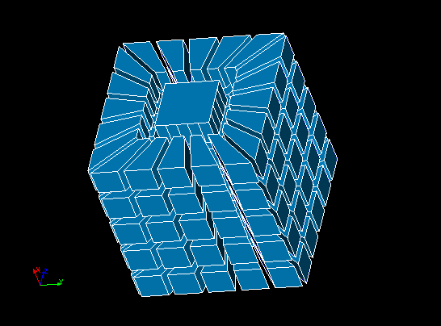
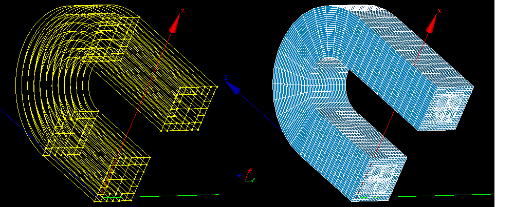

.. _tui_defining_hypotheses_page:

**********************************
Defining Hypotheses and Algorithms
**********************************

This page provides example codes of :ref:`defining algorithms <tui_defining_meshing_algos>`
and hypotheses.

* Wire discretisation 1D algorithm
  
    * :ref:`tui_1d_adaptive` hypothesis
    * :ref:`Arithmetic Progression <tui_1d_arithmetic>` hypothesis
    * :ref:`Geometric Progression <tui_1d_arithmetic>` hypothesis
    * :ref:`Deflection and Number of Segments <tui_deflection_1d>` hypotheses
    * :ref:`Start and End Length <tui_start_and_end_length>` hypothesis
    * :ref:`tui_average_length` hypothesis
    * :ref:`tui_propagation` additional hypotheses 
    * :ref:`Fixed Points 1D <tui_fixed_points>` hypothesis
  

* Triangle: Mefisto 2D algorithm
  
    * :ref:`tui_max_element_area` hypothesis 
    * :ref:`tui_length_from_edges` hypothesis 
  
* Quadrangle: Mapping 2D algorithm
  
    * :ref:`Quadrangle Parameters <tui_quadrangle_parameters>` hypothesis 

* :ref:`Radial Quadrangle 1D-2D <tui_radial_quadrangle>` algorithm
* NETGEN 3D algorithm
  
    *  :ref:`tui_max_element_volume` hypothesis 
    *  :ref:`Viscous layers <tui_viscous_layers>` hypotheses

* Hexahedron (i,j,k) 3D algorithm

   *   :ref:`tui_block_renumber`

* :ref:`tui_projection`
* :ref:`Extrusion 3D <tui_prism_3d_algo>` algorithm
* :ref:`Radial Prism <tui_radial_prism>` algorithm
* :ref:`Body Fitting <tui_cartesian_algo>` algorithm
* :ref:`Import 1D-2D Elements from Another Mesh <tui_import>` algorithm
* :ref:`Use Faces to be Created Manually <tui_use_existing_faces>` algorithm
* :ref:`Segments around Vertex <tui_segments_around_vertex>` algorithm

Defining 1D Hypotheses
######################

.. _tui_1d_arithmetic:

Arithmetic Progression and Geometric Progression
================================================

.. literalinclude:: ../../../examples/defining_hypotheses_ex01.py
    :language: python

:download:`Download this script <../../../examples/defining_hypotheses_ex01.py>`

.. _tui_1d_adaptive:

Adaptive
========

.. literalinclude:: ../../../examples/defining_hypotheses_adaptive1d.py
    :language: python

:download:`Download this script <../../../examples/defining_hypotheses_adaptive1d.py>`

.. _tui_deflection_1d:

Deflection and Number of Segments
=================================

.. literalinclude:: ../../../examples/defining_hypotheses_ex02.py
    :language: python

:download:`Download this script <../../../examples/defining_hypotheses_ex02.py>`

.. _tui_start_and_end_length:

Start and End Length
====================

.. literalinclude:: ../../../examples/defining_hypotheses_ex03.py
    :language: python

:download:`Download this script <../../../examples/defining_hypotheses_ex03.py>`

.. _tui_average_length:

Local Length
============

.. literalinclude:: ../../../examples/defining_hypotheses_ex04.py
    :language: python

:download:`Download this script <../../../examples/defining_hypotheses_ex04.py>`

Defining 2D and 3D hypotheses
#############################

.. _tui_max_element_area:

Maximum Element Area
====================

.. literalinclude:: ../../../examples/defining_hypotheses_ex05.py
    :language: python

:download:`Download this script <../../../examples/defining_hypotheses_ex05.py>`

.. _tui_max_element_volume:

Maximum Element Volume
======================

.. literalinclude:: ../../../examples/defining_hypotheses_ex06.py
    :language: python

:download:`Download this script <../../../examples/defining_hypotheses_ex06.py>`

.. _tui_length_from_edges:

Length from Edges
=================

.. literalinclude:: ../../../examples/defining_hypotheses_ex07.py
    :language: python

:download:`Download this script <../../../examples/defining_hypotheses_ex07.py>`

.. _tui_block_renumber:

Renumber 3D hypothesis
======================

.. literalinclude:: ../../../examples/filters_ex39.py
    :language: python

:download:`Download this script <../../../examples/filters_ex39.py>`

Defining Additional Hypotheses
##############################

.. _tui_propagation:

Propagation
===========

.. literalinclude:: ../../../examples/defining_hypotheses_ex08.py
    :language: python

:download:`Download this script <../../../examples/defining_hypotheses_ex08.py>`

.. _tui_defining_meshing_algos:

Defining Meshing Algorithms
###########################

.. literalinclude:: ../../../examples/defining_hypotheses_ex09.py
    :language: python

:download:`Download this script <../../../examples/defining_hypotheses_ex09.py>`

.. _tui_projection:

Projection Algorithms
=====================

.. literalinclude:: ../../../examples/defining_hypotheses_ex10.py
    :language: python

:download:`Download this script <../../../examples/defining_hypotheses_ex10.py>`

Projection 1D2D
===============

.. literalinclude:: ../../../examples/defining_hypotheses_ex11.py
    :language: python

:download:`Download this script <../../../examples/defining_hypotheses_ex11.py>`

.. _tui_fixed_points:

1D Mesh with Fixed Points example
#################################

.. literalinclude:: ../../../examples/defining_hypotheses_ex12.py
    :language: python

:download:`Download this script <../../../examples/defining_hypotheses_ex12.py>`

.. _tui_radial_quadrangle:

Radial Quadrangle 1D-2D example
###############################

.. literalinclude:: ../../../examples/defining_hypotheses_ex13.py
    :language: python

:download:`Download this script <../../../examples/defining_hypotheses_ex13.py>`

.. _tui_quadrangle_parameters:

Quadrangle Parameters example 1 (meshing a face with 3 edges)
##############################################################

.. literalinclude:: ../../../examples/defining_hypotheses_ex14.py
    :language: python

:download:`Download this script <../../../examples/defining_hypotheses_ex14.py>`

Quadrangle Parameters example 2 (using different types)
#######################################################

.. literalinclude:: ../../../examples/defining_hypotheses_ex15.py
    :language: python

:download:`Download this script <../../../examples/defining_hypotheses_ex15.py>`

.. _tui_import:

"Import 1D-2D Elements from Another Mesh" example
#################################################

.. literalinclude:: ../../../examples/defining_hypotheses_ex16.py
    :language: python

:download:`Download this script <../../../examples/defining_hypotheses_ex16.py>`

.. _tui_viscous_layers:

Viscous layers construction
###########################

.. literalinclude:: ../../../examples/defining_hypotheses_ex17.py
    :language: python

:download:`Download this script <../../../examples/defining_hypotheses_ex17.py>`

.. _tui_radial_prism:

Radial Prism example
####################

.. literalinclude:: ../../../examples/radial_prism_3d_algo.py
    :language: python

:download:`Download this script <../../../examples/radial_prism_3d_algo.py>`

.. _tui_cartesian_algo:

Usage of Body Fitting algorithm
###############################

.. literalinclude:: ../../../examples/cartesian_algo.py
    :language: python

:download:`Download this script <../../../examples/cartesian_algo.py>`

.. _tui_use_existing_faces: 

Usage of "Use Faces to be Created Manually" algorithm
#####################################################

This sample demonstrates how to use **Use Faces to be Created Manually** algorithm,
which is actually just a stub allowing to use your own 2D algorithm
implemented in Python.

.. literalinclude:: ../../../examples/use_existing_faces.py
    :language: python

:download:`Download this script <../../../examples/use_existing_faces.py>`

Resulting mesh:

.. _tui_prism_3d_algo:

Usage of Extrusion 3D meshing algorithm
########################################

.. literalinclude:: ../../../examples/prism_3d_algo.py
    :language: python

:download:`Download this script <../../../examples/prism_3d_algo.py>`

The result geometry and mesh is shown below

.. _tui_quad_ma_proj_algo:

Usage of Medial Axis Projection algorithm
#########################################

.. literalinclude:: ../../../examples/quad_medial_axis_algo.py
    :language: python

:download:`Download this script <../../../examples/quad_medial_axis_algo.py>`

.. _tui_segments_around_vertex:

Usage of Segments around Vertex algorithm
#########################################

.. literalinclude:: ../../../examples/defining_hypotheses_len_near_vertex.py
    :language: python

:download:`Download this script <../../../examples/defining_hypotheses_len_near_vertex.py>`

