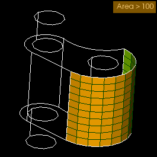
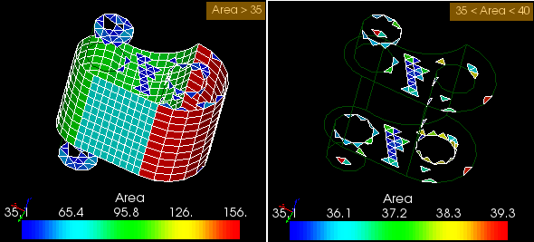

.. _tui_grouping_elements_page:

*****************
Grouping Elements
*****************

.. contents:: `Table of contents`

.. _tui_create_standalone_group: 

Create a Standalone Group
=========================

.. literalinclude:: ../../../examples/grouping_elements_ex01.py
    :linenos:
    :language: python

:download:`Download this script <../../../examples/grouping_elements_ex01.py>`

.. _tui_create_group_on_geometry: 

Create a Group on Geometry
==========================

.. literalinclude:: ../../../examples/grouping_elements_ex02.py
    :linenos:
    :language: python

:download:`Download this script <../../../examples/grouping_elements_ex02.py>`

.. _tui_create_group_on_filter: 

Create a Group on Filter
========================

.. literalinclude:: ../../../examples/grouping_elements_ex03.py
    :linenos:
    :language: python

:download:`Download this script <../../../examples/grouping_elements_ex03.py>`

.. _tui_edit_group: 

Edit a Group
============

.. literalinclude:: ../../../examples/grouping_elements_ex04.py
    :linenos:
    :language: python

:download:`Download this script <../../../examples/grouping_elements_ex04.py>`

.. _tui_union_of_groups: 

Union of groups
===============

.. literalinclude:: ../../../examples/grouping_elements_ex05.py
    :linenos:
    :language: python

:download:`Download this script <../../../examples/grouping_elements_ex05.py>`

.. _tui_intersection_of_groups: 

Intersection of groups
======================

.. literalinclude:: ../../../examples/grouping_elements_ex06.py
    :linenos:
    :language: python

:download:`Download this script <../../../examples/grouping_elements_ex06.py>`

.. _tui_cut_of_groups: 

Cut of groups
=============

.. literalinclude:: ../../../examples/grouping_elements_ex07.py
    :linenos:
    :language: python

:download:`Download this script <../../../examples/grouping_elements_ex07.py>`

.. _tui_create_dim_group: 

Creating groups of entities basing on nodes of other groups
===========================================================

.. literalinclude:: ../../../examples/grouping_elements_ex08.py
    :linenos:
    :language: python

:download:`Download this script <../../../examples/grouping_elements_ex08.py>`

