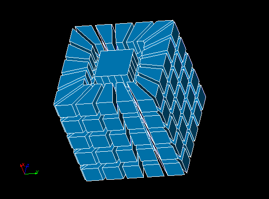

.. _tui_use_existing_faces: 

*****************************************************
Usage of "Use Faces to be Created Manually" algorithm
*****************************************************

This sample demonstrates how to use **Use Faces to be Created Manually** algorithm,
which is actually just a stub allowing to use your own 2D algorithm
implemented in Python.

.. literalinclude:: ../../../examples/use_existing_faces.py
    :linenos:
    :language: python

:download:`Download this script <../../../examples/use_existing_faces.py>`

Resulting mesh:

