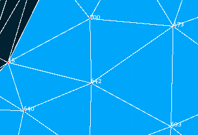
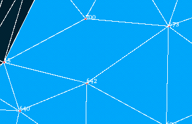

.. _uniting_two_triangles_page: 

*********************
Uniting two triangles
*********************

In MESH you can union two neighboring triangles by deletion of the common edge.

**To unite two triangles:**

#. From the **Modification** menu choose the **Union of two triangles** item or click **"Union of two triangles"** button in the tool-bar.

	.. image:: ../images/image71.png
		:align: center

	.. centered::
		**"Union of two triangles" button**

	The following dialog box shall appear:

	.. image:: ../images/unionoftwotriangles.png
		:align: center

#. Enter IDs of nodes forming the required edge in the **Edge** field (a couple of node IDs separated by a dash) or select this edge in the 3D viewer.
#. Click the **Apply** or **Apply and Close** button.

.. centered::
	"The selected triangles"

.. centered::
	"The union of two triangles" 

**See Also** a sample TUI Script of a 
:ref:`tui_uniting_two_triangles` operation.  

