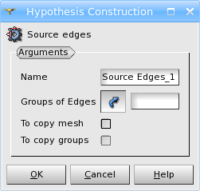
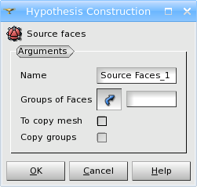

.. _import_algos_page: 

********************************************
Import Elements from Another Mesh Algorithms
********************************************

**Import Elements from Another Mesh** algorithms allow to
define the mesh of a geometrical 
object by importing suitably located mesh elements from another
mesh. The mesh elements to import from the other mesh should be contained in
groups. If several groups are used to mesh the same geometry, validity of
nodal connectivity of result mesh must be assured by connectivity of
the source mesh; no geometrical checks are performed to merge
different nodes at same locations.

The source elements must totally cover the meshed geometry.
The source elements lying partially over the geometry will not be used.

These algorithms can be used to mesh a very complex geometry part by
part, by storing meshes of parts in files and then fusing them
together using these algorithms.

**Import 1D Elements from Another Mesh** algorithm allows to define
the mesh of a geometrical edge (or group of edges)
by importing mesh edges contained in a group (or groups) from another mesh.
 
To apply this algorithm select the edge to be meshed (indicated in
the field **Geometry** of **Create mesh** dialog box),
**Import 1D Elements from Another Mesh** in the list of 1D
algorithms and click the *"Add Hypothesis"* button.
The following dialog box will appear:

In this dialog box you can define 

* The **Name** of the algorithm. 
* The **Groups of Edges** to import 1D elements from.
* **To copy mesh** checkbox allows to import not only the edges of the selected **Groups of Edges**, but the whole source mesh. In this case **To copy groups** checkbox allows to create the same groups as in the imported source mesh.

**Import 1D-2D Elements from Another Mesh** algorithm allows to define the mesh of a geometrical face (or group of faces) by importing mesh faces contained in a group (or groups) from another (or this) mesh. 1D elements on the boundary of the geometrical face (if not yet present) are also created by the algorithm in conformity with the created 2D elements.

To apply this algorithm select the geometrical face to be meshed (indicated in the field **Geometry** of **Create mesh** dialog box), **Import 1D-2D Elements from Another Mesh** in the list of 2D algorithms and click the *"Add Hypothesis"* button.

The following dialog box will appear:

In this dialog box you can define 

* The **Name** of the algorithm. 
* The **Groups of Faces** to import 2D elements from.
* **To copy mesh** checkbox allows to import not only the faces of the selected **Groups of Faces**, but the whole source mesh. In this case **To copy groups** checkbox allows to create the same groups as in the imported source mesh.

**See Also** a sample TUI Script of :ref:`Import 2D Elements from Another Mesh <tui_import>`.
