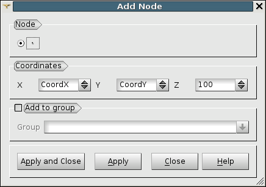

.. _using_notebook_mesh_page: 

*********************
Using SALOME NoteBook
*********************

**SALOME NoteBook** allows defining variables to be used for
creation and modification of objects.

.. centered::
	"Setting of variables in SALOME NoteBook"

.. centered::
	"Use of variables to add a node in MESH module"

The following limitations on the use of variables still exist:

* :ref:`radial_prism_algo_page` hypothesis - parametrical values are correctly applied, but they are not restored after "Update study" operation.
* :ref:`a1d_meshing_hypo_page` hypothesis, Distribution with Table Density and Distribution with Analytic Density - parametrical values are not applicable.
* :ref:`translation_page` dialog box, default mode (translation by two points) - parametrical values are correctly applied, but they are not restored after "Update study" operation.
* :ref:`merging_nodes_page` dialog box - parametrical value (tolerance of coincident nodes detection) is correctly applied, but it is not restored after "Update study" operation.
* :ref:`revolution_page` dialog box - it is impossible to use the angle of revolution as "total angle" if it is defined as variable.
* :ref:`extrusion_along_path_page` dialog box - it is impossible to use "Linear variation of the angles" mode if at least one of those angles is defined as variable.
* :ref:`pattern_mapping_page` dialog box - parametrical values (indices of nodes) are correctly applied, but they are not restored after "Update study" operation.
* :ref:`clipping_page` dialog box.
* **Properties** dialog box.

Our **TUI Scripts** provide you with useful examples of 
:ref:`tui_notebook_smesh` .

