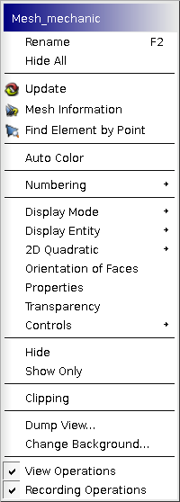

.. _viewing_meshes_overview_page: 

**************
Viewing meshes
**************

By default a just :ref:`computed <compute_anchor>` mesh will be
automatically displayed in the **VTK 3D Viewer**. (You can switch
off :ref:`Automatic Update <automatic_update_pref>` preference parameter
to prevent this.)
Click **Display only** to hide all other objects at the same time.

**VTK 3D Viewer** is described in detail in the documentation on **GUI module**.

Use the following :ref:`preference parameters <mesh_preferences_page>` 
to adjust how the mesh is displayed by default:

* :ref:`Automatic Update <automatic_update_pref>` 
* :ref:`Default display mode <display_mode_pref>` 
* :ref:`Representation of the 2D quadratic elements <quadratic_2d_mode_pref>` 
* All parameters of :ref:`Mesh <mesh_tab_preferences>` tab page of Preferences dialog.

After the mesh has appeared in the Viewer, you can select it with
left mouse click and  get information about it, change its
presentation parameters and access to other useful options by
right-clicking on the selected mesh.

* **Rename** - allows to rename the object in the Object browser.
* **Hide all** - allows to hide all objects in the viewer.
* **Update** - refreshes the presentation of your mesh in the Object Browser, applying all recent changes. 
* :ref:`Mesh Information <mesh_infos_page>` -  provides information about the mesh.
* :ref:`Find Element by Point <find_element_by_point_page>` - allows to find all mesh elements, to which belongs a point with the given coordinates.
* **Auto Color** - switch on / off auto-assigning colors for the groups. If switched on, a default color of a new group in :ref:`Create Group <creating_groups_page>` dialog is chosen randomly. 
* :ref:`Numbering <numbering_page>` - allows to display the ID numbers of all meshing elements or nodes composing your mesh in the viewer.
* :ref:`Display Mode <display_mode_page>` - allows to select between Wireframe, Shading and Nodes presentation.
* :ref:`Display Entity <display_entity_page>` - allows to display entities by types (Faces, Edges, Volumes etc.).

.. _quadratic_2d_mode:

* **2D Quadratic** - allows to select between the representation of quadratic edges as broken **lines** or as **arcs**. A default representation can be set in :ref:`Preferences <quadratic_2d_mode_pref>`. Arc representation applies to 1D and 2D elements only.
* **Orientation of faces** - shows vectors of orientation of faces of the selected mesh. The orientation vector is shown for each 2D mesh element and for each free facet of a 3D mesh element. The vector direction is calculated by the first three nodes of the face produced by vectors n1-n2 and n1-n3.
* :ref:`Properties <colors_size_page>` - allows to define several visual properties, including color of elements, shrink size, ...
* :ref:`Transparency <transparency_page>` - allows to change the transparency of mesh elements.
* :ref:`Controls <quality_page>` - graphically presents various information about the mesh. 
* **Hide** - allows to hide the selected mesh from the viewer.
* **Show Only** - allows to display only the selected mesh, hiding all others from the viewer. If :ref:`Fit All upon Show Only <display_mode_pref>` Preference option is active, *Fit All* command is additionally performed.
* :doc:`clipping` - allows to create cross-sections of the displayed objects.
* **Dump view** - exports an object from the viewer in bmp, png or jpeg image format.
* **Change background** - allows to redefine the background color. By default it is black.
* **View Operations** - allows to show/hide the  visualization toolbar in the Viewer window.
* **Recording Operations** - allows to show/hide the recording toolbar in the Viewer window.

**Table of Contents**

.. toctree::
   :maxdepth: 2
   :titlesonly:

   mesh_infos.rst
   find_element_by_point.rst
   numbering.rst
   display_mode.rst
   display_entity.rst
   colors_size.rst
   transparency.rst
   clipping.rst
