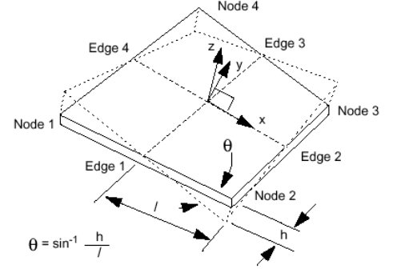

.. _warping_page: 

*******
Warping
*******

**Warping** indicates that a face is not planar and is applied only to
2D elements with 4 nodes. This quality control criterion is based on a
projection plane created by:

#. bisecting the four element edges,
#. creating a point on the plane at the vector average of the corners, where the x-axis extends from the point to the bisector on edge 2.

The plane normal is in the direction of the cross product of the
x-axis and the vector from the origin to the bisector of edge 3. Every
corner of the quad will then be a distance *h* from the plane. The
length of each half edge is measured and the shortest length is
assigned *l*. The warp angle is the arcsine of the ratio of the
projection height *h* to the half edge length *l*.

*To apply the Warping quality criterion to your mesh:*

#. Display your mesh in the viewer.
#. Choose **Controls > Face Controls > Warping Angle** or click *"Warping angle"* button |img| of the toolbar.

   Your mesh will be displayed in the viewer with its elements colored according to the applied mesh quality control criterion:

	.. image:: ../images/image97.jpg
       		:align: center

**See Also** a sample TUI Script of a :ref:`tui_warping` filter.
