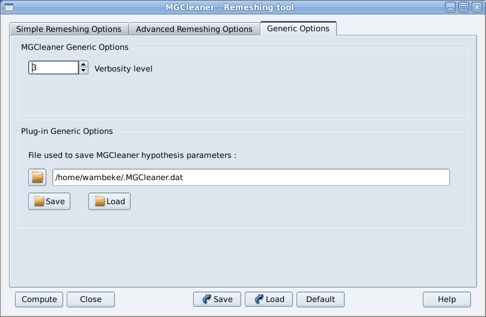

Generic  Options
=================

These options are not meshing options but allow the user to configure control parameters for MG-Cleaner.

- **Verbosity Level**

This parameter (between 0 and 10) indicates the amount of information that MG-Cleaner prints during the run.
    
    
- **File** 

You can change the file used to store your favorite remeshing hypothesis. see paragraph :ref:`hypothesis-label` for further informations.

