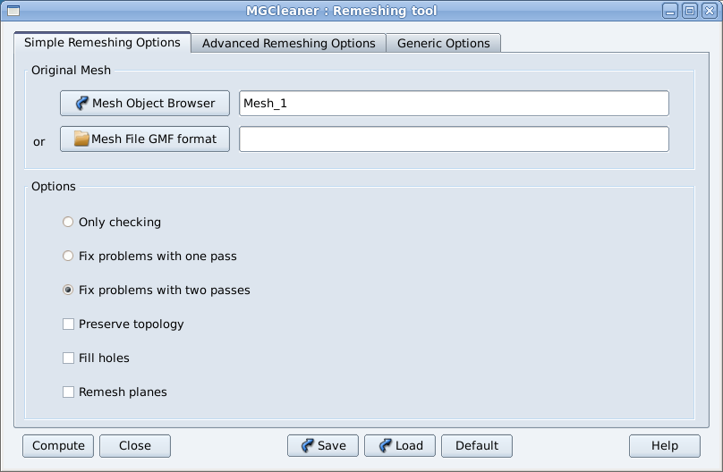

Simple Remeshing Options
=========================

simple case 
-----------

   All options, but the input mesh, have default values. however, **you have to specified these
   simple options in order to drive MG-Cleaner and control remeshing parameters**. 

   You can access Distene documentation by clicking on Help button.

- **Original Mesh**

   You have to select a Mesh Object from Salome Object Browser or choose a .GMF file.

Options
------------
    
This is the main remeshing Option.
   

