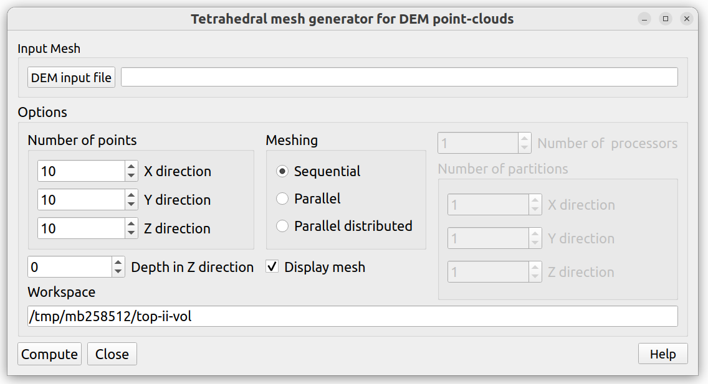

Introduction
============

**topIIvol** meshing tool provides sequential and parallel tools for creating volumetric tetrahedral meshes from a given terrain topology via digital elevation model (DEM point-cloud `*.xyz`). Via this plugin one could produce distributed meshes suitable for domain-decomposition based solvers or simply non distributed meshes (single mesh) suitable for a sequential/parallel solver.

Running topIIvol Plug-in
========================

**topIIVolMesh** plug-in can be invoked via SMESH Plugin item in Mesh menu bar 

**topIIVolMesh** Options
========================

Users have option of performing meshing via:

- *Sequential* mode: mesh computation in sequential and outputs a single mesh.
- *Parallel* mode: mesh computation in parallel and outputs a single mesh. 
- *Parallel distributed* mode: mesh computation in parallel and outputs partitioned meshes.

Sequential mode
---------------
By default sequential meshing mode is activated. **topIIvol_Mesher** sequential tool is called for creating volumetric tetrahedral mesh for the given DEM point-cloud. The volumetric mesh can be displayed in SALOME by ticking the "Display mesh" check-box.

The list of input parameters are:

- DEM input file: input point cloud file in .xyz format;
- Number of X points present in the input point cloud;
- Number of Y points present in the input point cloud;
- Number of Z points intended in the Z direction;
- Depth of the mesh needed;
- temporary directory for calculation.

Parallel mode
---------------
For larger meshes the parallel meshing mode can be activated via the check-box **Parallel**. Additionally, this requires the user to provide the number of processors to be used for parallel meshing. Then, **topIIvol_ParMesher** parallel computing tool is called for creating volumetric tetrahedral mesh for the given DEM point-cloud. The volumetric mesh can be displayed in SALOME by ticking the "Display mesh" check-box.

The list of input parameters are:

- DEM input file: input point cloud file in .xyz format;
- Number of X points present in the input point cloud;
- Number of Y points present in the input point cloud;
- Number of Z points intended in the Z direction;
- Depth of the mesh needed;
- Number of MPI ranks
- temporary directory for calculation.

Parallel distributed mode
-----------------
For larger meshes suitable for distributed-memory solvers (domain-decomposition) the distributed parallel meshing mode can be activated via the check-box **Parallel distributed**. This requires the user to provide the number of processors to be used for parallel meshing and how to partition the mesh in each direction (X, Y, Z). Then,  **topIIvol_DistMesher** computing tool is called for creating embarrassingly parallel distributed meshes for the given DEM point-cloud. These volumetric mesh partitions can be displayed in SALOME by ticking the "Display mesh" check-box.

The list of input parameters are:

- DEM input file: input point cloud file in .xyz format;
- Number of X points present in the input point cloud;
- Number of Y points present in the input point cloud;
- Number of Z points intended in the Z direction;
- Depth of the mesh needed;
- Number of partitions in X direction;
- Number of partitions in Y direction;
- Number of partitions in Z direction;
- Number of MPI ranks
- temporary directory for calculation.

