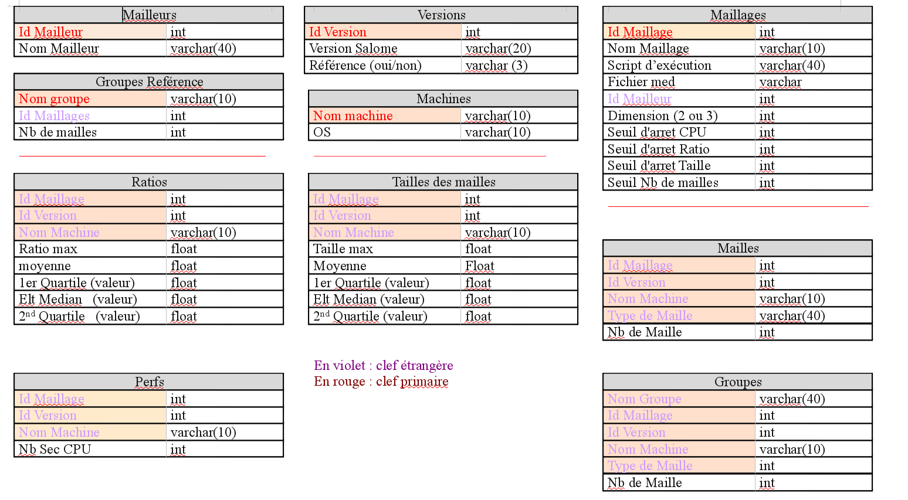

la base
========

Schéma de la base
-----------------

Organisation des sources
------------------------

  Les sources sont organisées ainsi :

  * La directory MaquetteMailleur contient les pythons nécessaires au passage des tests : 

      - createDatabase.py    
      - ajoutEnreg.py  
      - changeVersion.py  
      - passeJobs.py.
      - compareVersions.py  
      - lance.py  
  
   a priori, seuls les scripts passeJobs.py et compareVersions ne devront être passés à chaque version

  * Elle contient aussi la base de données (lorsque celle-ci a été créée)

  * Sous MaquetteMailleur, la directory Doc contient les fichiers nécessaires à l'élaboration de la doc. 
  * Sous MaquetteMailleur, la directory Scripts contient les fichiers nécessaires à l'éléboration des maillages et référencés dans la database.
  * Sous MaquetteMailleur, la directory Gui contient les fichiers nécessaires à la partie graphique, y compris les .ui à partir desquels il faut générer les .py
  * Sous MaquetteMailleur, la directory CreeDocuments contient les fichiers nécessaires à la création du rapport html. les patrons sont contenus dans TemplatesHtm 

La directory Base plus en détail 
--------------------------------

  * dataBase.py : definition de la class Base
    La méthode Structure (jamais appelée) rappelle la commande sqlite3 pour voir de façon interactive la structure de la base (sqlite3 madabase.db)

  * les tables
    - une classe générique contenue dans tableDeBase
    - un fichier .py par table : tableGroupesRef.py, tableMaillages.py, tableMailleurs.py, tableRatios.py, tableVersions.py, tableGroupes.py, tableMachines.py, tableMailles.py, tablePerfs.py, tableTailles.py.  toutes les tables heritent de tableDeBase
    - la methode "remplit" remplit le jeu de test et doit être modifiée (en particulier pour la définition de la version de reference)

  * création éventuelle d'une nouvelle table il faut :
	- creer un fichier tableNouvelle.py
	- dans l'init appeler l init de TableDeBase avec le nom de la table en parametre
          et initialiser le nom des colonnes avec la methode setFields
        - creer une methode createSqlTable pour creer la table

     .. code-block:: python

        class TableMachines (TableDeBase):
           def __init__(self):
               TableDeBase.__init__(self,"Machines")
               self.setField(("id","nomMachine","Os"))

           def createSqlTable(self):
               query=QtSql.QSqlQuery()
               print "creation de TableMachine"
               print query.exec_("create table Machines(id int primary key, nomMachine varchar(10), os varchar(10));")

 
    - pour pouvoir éditer la nouvelle table il faut :
        - ajouter un bouton par designer dans desFenetreChoix.ui
        - creer un signal dans maFenetreChoix.py qui appelle une methode qui
          ressemble a :

     .. code-block:: python

      def Push(self):
           editor=TableEditor(self.db.maTable,self)
           editor.exec_()

