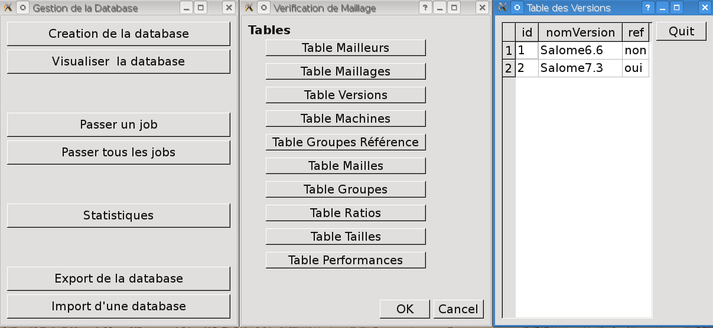

Utilisation de l'outil
======================
Introduction
-------------
Avant d'utiliser les différents scripts décrits ci-dessous, il faut préalablement taper dans un terminal la commande ./runSession dans le répertoire Salome où se situe le runSession. On peut trouver les différents scripts au niveau du répertoire : ./Salome-n°version/modules/SMESH_n°version/share/salome/plugins/smesh/Verima

Création de la base
--------------------

La base de données ne doit, à priori, n'être créée qu'une unique fois. Cependant, relancer le script de création ne changera pas les informations contenues dans la base et n'a pas d'incidence sur la base ni sur son contenu.

  * createDatabase.py
        - Crée la structure de la base et le fichier myMeshDB.db
        - Si le fichier myMeshDB.db (c'est à dire si la base) existe déjà, le script ne modifie pas la structure des tables et n'affecte pas les enregistrements qu'elles contiennent déjà.
        - Le script a un unique paramètre optionnel : le nom de la database. 

     .. code-block:: python

          python createDatabase.py -d maBaseAMoi.db

Initialisation d'un jeu de tests par défaut 
-------------------------------------------
Si on le souhaite, on peut initialiser un jeu de tests par défaut. Ce jeu de tests s'applique aux versions, aux mailleurs testés, aux scripts de maillage et enfin aux groupes de référence associés à ces maillages.
Les quatres fichiers python se situent dans le répertoire Base.

  * Pour les versions, il s'agit du fichier tableVersions. Dans la méthode "remplit", on renseigne :
        - Le nom de la version
	- Un commentaire

  * Pour les mailleurs, il s'agit du fichier tableMailleurs. Dans la méthode remplit, on renseigne :
        - Le nom du mailleur

  * Pour les scripts, il s'agit du fichier tableMaillages. Dans la méthode remplit, on renseigne :
        - Le nom du cas test
        - Le nom du script python
	- Le nom du fichier med
        - Le numéro de l'identifiant correspondant au mailleur testé
        - La dimension maximale du maillage
        - Les quatres seuils correspondant aux quatres critères à savoir le temps CPU, l'aspect ratio, la longueur et enfin le nombre d'entités
	- Un commentaire

  * Pour les groupes de référence, il s'agit du fichier tableGroupesRef. Dans la méthode remplit, on renseigne :
        - Le nom du groupe
	- Le numéro d'identifiant correspondant au maillage

Remarque : actuellement, le jeu par défaut porte : 
  * sur les versions
	- n°id=1,'Salome7.2.0'
	- n°id=2,'Salome7.3.0'
	- n°id=3,'Salome7.4.0'
  * sur les mailleurs
	- n°id=1,'BLSURF'
	- n°id=2,'NETGEN1D2D'
	- n°id=3,'GHS3D+BLSURF'
	- n°id=4,'GHS3D+NETGEN1D2D'
	- n°id=5,'NETGEN1D2D3D'
  
Ajouter un enregistrement à une table 
-------------------------------------

Lors d'une nouvelle version de Salome, de l'arrivée d'un nouveau cas test ou d'un nouveau mailleur, il sera nécessaire d'enrichir la base de données. Aucun contrôle sur la cohérence des valeurs n'est effectué. 

  * l'autoincrement

   Les identifiants ("id") des tables Maillages, Mailleurs et Versions sont crées de façon automatique lors de l'insertion d'un enregistrement dans la table. Il n'est ni possible ni nécessaire de les préciser lors de la création d'un enregistrement.
   Ainsi, pour ajouter un mailleur, il suffit de spécifier son nom.

 
  * ajoutEnreg.py

        - Le script a deux paramètres : le nom de la database (optionnel) et le nom de la table qu'il faut enrichir.
          les valeurs des colonnes doivent être fournies dans l'ordre.

         .. code-block:: python

            python ajoutEnreg -d maBaseAMoi.db -t TableMailleurs  "monMailleur"

        - Les contrôles effectués sont minimaux : nombre de valeurs de l'enregistrement et identifiant. En revanche, la cohérence entre tables n'est pas vérifiée. Ainsi, par exemple, pour entrer un nouveau cas test, il faut ajouter un enregistrement à la table des maillages. Si l'identifiant du mailleur n'existe pas, aucune erreur ne sera détectée.

         .. code-block:: python

          python ajoutEnreg -d maBaseAMoi.db -t TableMailleurs  "monMailleur"
          python ajoutEnreg -d maBaseAMoi.db -t TableMaillages  "monMaillage" "mesScripts/lanceMonMaillage" "/tmp/monFichierMed" 4 3 5 5 5 5 "essai pour mon Mailleur"

       
Changement de la version de référence
-------------------------------------
 
A priori, cette fonction ne devrait pas être utilisée. mais ... Elle permet de changer la version de référence.

  * changeVersion.py

         .. code-block:: python

            python changeVersion.py Salome7.3 ou
            python changeVersion.py 3

Consultation des tables
-----------------------

  * le script Gui/visualiseDatabase.py (qui peut également être lancé de l'outil générique lance.py) permet de visualiser les tables contenues dans la base. (Attention au path de la database)

         .. code-block:: python

            python visualiseDatabase.py -d ../myMesh.db

Lancer un job de maillage particulier ou l'ensemble des tests
----------------------------------------------------------------

   * le script passejob.py permet de passer l'ensemble des tests ou un cas particulier. il admet les options suivantes :

       - '-a' pour passer l ensemble des Tests (non activée par defaut)
       - '-s' pour preciser le path du runAppli (par exemple ~/Appli). Permet au job de trouver le runAppli
       - '-d' pour preciser le fichier dataBase
       - '-v' pour spécifier la version de Salome
       - si l'option -a n'est pas activée, il faut préciser l'identifiant du job à passer 

         .. code-block:: python

            python passeJobs.py -d ../myMesh.db 1

Modifier les scripts pour les intégrer dans le mécanisme de test 
-------------------------------------------------------------------

    * ajout des lignes suivantes à la fin du script :

         .. code-block:: python

            from Stats.getStats import getStatsMaillage, getStatsGroupes
            from Stats.getCritere import getStatsCritere
            # 
            fichierMedResult = 'fichierMed.med'
            getStatsMaillage(monMaillage,fichierMedResult)
            getStatsGroupes(monMaillage,fichierMedResult)
            getStatsCritere(dimMaillage,monMaillage,fichierMedResult,theStudy)

Lancement du script de comparaison
-----------------------------------
  * compareVersions.py
       - '-s' pour preciser le path du runAppli (par exemple ~/Appli). permet au job de trouver le runAppli
       - '-r' pour spécifier les numéros de versions de référence pour chacun des scripts
       - '-d' pour preciser le fichier dataBase
       - '-f' pour spécifier le nom du rapport html produit (/tmp/toto.html par défaut -) )

         .. code-block:: python

           python compareVersions.py -s ./runAppli -r 1,2,2 -d ./myMesh.db -f ./rapport.html
 

   Ici, pour les scripts n°1, 2 et 3, les versions de référence sont, respectivement "Salome7.2.0", "Salome7.3.0" et "Salome 7.3.0".

export/import de la base
-------------------------
  * exportDatabaseToCSV.py 

    - admet l option  -p (pour partiel) qui ne sauvegarde pas les tables a priori communes a tous : 
            * la table des mailleurs
            * la table des maillages
            * la table des versions
            * la table des machines
            * la table des groupes references

   - les fichiers sont ranges dans la directory ExportDB+date. la premiere ligne de chaque fichier contient le nom des colonnes, puis les valeurs par ligne

   - pour faire une vraie sauvegarde de la base (structure et donnees) il faut lancer sqlite3 et executer .dump

  * importDatabaseFromCSV.py

    - parametre d 'entree obligatoire : la directory qui contient les fichiers a importer 
    - admet l option  -p (pour partiel) qui n importe pas les tables a priori communes a tous  
    - admet l option  -f (pour force) qui pour les enregistrements qui existent déjà dans la base remplace 
      par les valeurs donnees dans le fichier

Critères de vérification
========================
Principe
--------
Le principe est simple.
Pour chaque maillage, on définit des valeurs de référence associées au maillage. A chaque nouvelle version de Salome, on compare les résultats obtenus avec ces valeurs de référence pour le script étudié. On émet un warning à chaque fois que les écarts relatifs dépassent un certain seuil. 

Critères
--------
Les critères de vérification portent sur :

  * Le temps CPU

  * Le nombre d'entités du maillage classé par type
        - Le nombre de noeuds
        - Le nombre de segments (maille 1D)
        - Le nombre de triangles (maille 2D)
        - Le nombre de quadrangles (maille 2D)
        - Le nombre de tétraèdres (maille 2D)

  * Le rapport de tailles de chaque élément du maillage (fonction GetAspectRatio)
        - Pour un maillage 3D, on calcul le ratio des mailles 3D
        - Pour un maillage 2D, on calcul le ratio des mailles 2D

  * La longueur de chaque élément du maillage (fonction GetMaxElementLength)  
        - Pour un maillage 3D, on calcul la longueur des mailles 3D
        - Pour un maillage 2D, on calcul la longueur des mailles 2D

Ces critères sont calculés sur tout le maillage et éventuellement sur des groupes de mailles de référence associés au maillage.

Pour chaque maillage, les valeurs de référence sont calculées sur la base d'une version spécifique de Salome (qui peut être différente d'un maillage à l'autre).

Pour le rapport de tailles et la longueur des mailles, on calcule systématiquement le maximun, le minimum, la moyenne, le 1er et 3ème quartile et enfin la médiane.

Pour ces quatres critères, on définit un seuil à ne pas dépasser (qui peut être différent d'un critère à l'autre). Actuellement, au sein d'un même critère, les seuils sont identiques.

