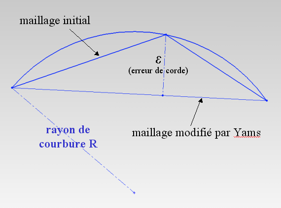

Advanced Remeshing Options 
==========================

.. note:: 
  Be aware that no control of coherency is done when you set these parameters : for instance, geometrical approximation is only allowed when SurfOpt computes a mesh for finite elements but the GUI will let you choose geometrical approximation and compute a visualisation mesh. See Distene's documentation for more details : 
  :download:`MeshGems-SurfOpt: The automatic surface remeshing tool of the MeshGems Suite <files/mg-surfopt_user_manual.pdf>`.

  
- **Ridge detection**
if not set (ridge detection disabled ), MeshGems-SurfOpt will not try to detect any new ridge edge by its own mechanism : 
it will consider as ridge only the ridges given in the mesh.  All non-ridge edges that would have been detected as ridge by the Ridge angle paramaeter (see below split edge)  will be considered as part of the same continuous patch.  This option should not be checked when all the known ridges of the mesh are given and when all other possible ridges are not geometric ridges to take into account.

- **Point smoothing**
When not set (point smoothing is disabled), MeshGems-SurfOpt will not try to move the initial given vertices (along an edge, a ridge or onto the surface), hence MeshGems-SurfOpt will only swap edges, remove vertices or add vertices (refines) to change the mesh.

- **Geometrical  approximation**
this field as well as the Chordal deviation tolerance parameter,enables the user to bound the maximal chordal deviation allowed. it avoids having sharp angles. , that is, the maximal distance allowed between the detected curve and the plane of the corresponding mesh face. It avoids having faces too far away from the curve they represent.

This parameter P enables the user to specify the maximal chordal deviation  E relatively to the local curvature. the maximal chordal deviation will be set to E=P x r (r is the radius of the circumcercle) if the units parameter is set to relative or E=P if the units parameter is set to absolute.

- **Ridge angle**

This parameter specifies the angular values  for the automatic detection of ridges and corners. A ridge is automatically detected if the angle between the normal vectors of two adjacent faces exceeds this value.

- **Maximal/Minimal size around vertices**

These two parameters allow the user to prescribe a Maximal/Minimal size for the mesh elements, ie the lengths of the edges. 

- **Mesh gradation**
This paramater P controls the element size variation : MeshGems-SurfOpt will avoid having two adjacent egdes which sizes vary more than th given gradation. a size correction is applied to the size map : if two adjacent edges are respectively e1 and e2 long and e2 > Pxe1, then, the new size for the second edge will be set to P x e1.
**This procedure is desactived if P=-1**

- **Split edge**
If this option is activated, MeshGems-SurfOpt creates new vertices placed on the curved surface and adds them to elements.
It may be used to obtain higher order elements.

