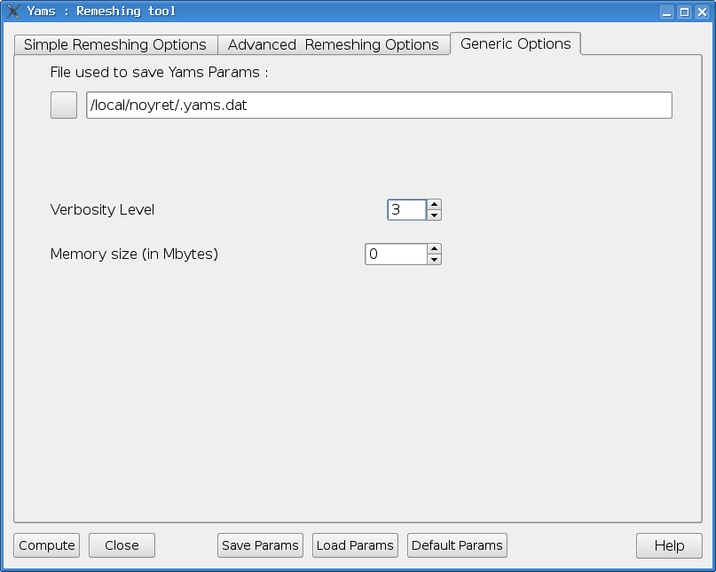

Generic  Options
=================

These options are not meshing options but allow the user to configure control parameters for MeshGems-SurfOpt.

- **Verbosity Level**

This parameter (between 0 and 10) indicates the amount of information that MeshGems-SurfOpt prints during the run.

- **Memory Size**
You usually don't have to set this parameter but you can choose to limit the amount of memory used by MeshGems-SurfOpt -- It requires 370 bytes per node. Or, if you try to enrich a already big mesh (up to 2 millions nodes), you exceptionally, need to allocate more memory.
    
    
- **File** 

You can change the file used to store remeshing hypotheses, see :ref:`hypothesis-label` for further informations.

