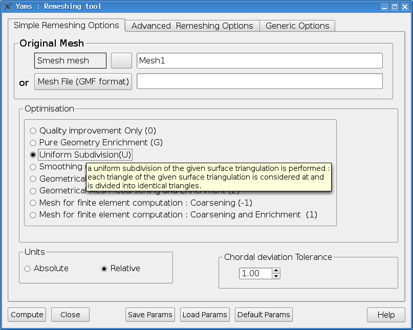
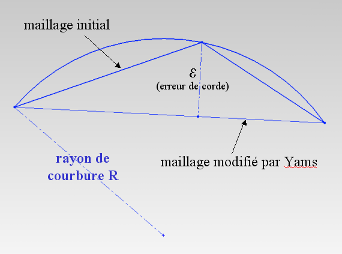

Simple Remeshing Options
=========================

Simple case 
-----------

   All options, but the input mesh, have default values. however, **you have to specify these
   simple options in order to drive MG-SurfOpt and control remeshing parameters**. 

   You can access Distene documentation by clicking on Help button.

- **Original Mesh**

   You have to select a Mesh Object from Salome Object Browser or choose a .GMF file.

Optimisation
------------
    
This is the main remeshing Option.  SurfOpt always does quality improvement. It is done by point smooting and edge swapping.  It can produce a regular mesh for finite element computation (initial mesh is a a geometrical mesh). In this case, the given surface trianglation is modified in accordance to a size map : an intrinsic size map is computed automatically. it is based on the surface proporties.  SurfOpt is also able to  produce a geometrical mesh (initial mesh is a a mesh for finite element computation). In both case, It can coarsen or enrich the mesh.     

   - **Quality improvement** 

     If you activitate this option, SurfOpt does only quality improvement.  

     It is equivalent to SurfOpt's batch option *- - optimisation only*.

   - **Pure Geometry Enrichement**

     The given surface triangulation is enriched (no coarsening at all) in such away that the distance between the elements in the final mesh and those of the initial one is bounded by auser specified tolerance value. One should use this option, to enrich the mesh where purely geometrical features may be insuficiently fine, i.e. the resulting mesh will be least as fine as the input. Mesh and the geometric features will be refined if needed as specified by the other program parameters. The meshes obtained with those settings may not be suitable for computation.

     It is equivalent to SurfOpt's batch option G.

   -  **Uniform subdivision**

     A uniform subdivision of the given surface triangulation is performed : each triangle of the given surface triangulation is considered at and is divided into identical triangles.

     It is equivalent to SurfOpt's batch option *- - uniform_flat_subdivision yes*.

   - **Sandpapering**

     A surface sandpapering without shrinkage of the given surface triangulation is performed, i.e., the high curvature variations of the given surface will be smoothed out without shrinking the volume in doing so. If ridges are defined, they will be kept as they are in the resulting mesh. It could modify the geometry.
     It is equivalent to SurfOpt's batch option *- - sand_paper yes*.

   - **Geometrical Mesh : Coarsening** 

     The given surface triangulation is modified in such a way that the distance between the elements in the final mesh 
     and those of the initial one is bounded by a user specfied tolerance value.
     One should use this option, to coarsen when a purely geometrical mesh is needed. (a mesh that keeps and obeys its geometric features only.) 
     The meshes obtained with this option are usually not suitable for computation because anisotropic elements may be generated

     It is equivalent to SurfOpt's batch option *- - Hausdorff_like yes - - enrich no*.

   - **Geometrical Mesh : Coarsening and Enrichment** 

     SurfOpt coarses and enrichs meshes to obtain a purely geometrical mesh. The method is the same as above.

     It is equivalent to SurfOpt's batch option *- - Hausdorff_like yes*.

   - **Mesh for finite element computation : Coarsening** 

     The given surface triangulation is modified in accordance to a size map. The latter is the intrinsic size map (computed automatically and based on the surface properties, i.e. the local curvatures). One should use this option to coarsen  the mesh, when a regular mesh  for computation purposes is desired, i.e. a mesh with good aspect ratios or good quality elements.

     It is equivalent to SurfOpt's batch option *- - enrich no*.

   - **Mesh for finite element computation : Coarsening and Enrichment**

     One should use this option to coarsen  and enrich the mesh, when a regular mesh for computation purposes is desired, i.e. a mesh with good aspect ratios or good quality elements. The method is the same as above.

     It is equivalent to the default SurfOpt's behaviour (no option) .
   

Units parameter
---------------

It indicates what reference is used for the values corresponding to size or distance specifications:
If the Units parameter is absolute, values are relative to the bounding box,otherwise the tolerance parameter is expressed in model units. The bounding box size is defined as the length of the diagonal (lower left back icorner to upper right front corner).

Chordal deviation tolerance parameter
-------------------------------------

This field enables the user to bound the maximal chordal deviation allowed, that is, the maximal distance allowed between the detected curve and the plane of the corresponding mesh face. It avoids having faces too far away from the curve they represent.

This parameter enables the user to specify the maximal chordal deviation epsilon max.

it can be :
  - relative : the maximal chordal deviation - epsilon max - is set to *s x the parameter* where *s* is the size 
    of the bounding box longest diagonal. 
    By default, the parameter is set to 0.001 and the maximum deviation is then set to 0.001 x s,  
    which is equivalent to say that, for a bouding box of 1 meter, the maximal deviation is 1 mm.
  - absolute : the maximal chordal deviation is the parameter itself. eg if the parameter equals 2, the maximal chordal deviation will be 2 (mm if the point coordonates are given in mm).

Following that criterion:
  - if the chordal deviation epsilon is smaller than epsilon max, it is acceptable to remove the considered point.
  - if the chordal deviation epsilon is greater than epsilon max, the considered mesh face should be redifined by adding a point on the curve.

